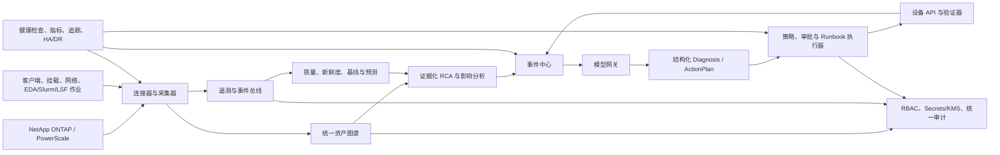

# DiskPulse 企业级 AI 存储智能运维调研报告

- 状态：预研基线（仅设计，非已实现功能）
- 调研日期：2026-07-17
- 目标场景：芯片/IC 企业私有化部署，重点覆盖 NetApp ONTAP 与 Dell PowerScale（Isilon）
- 产品边界：接入第三方 AI 模型，用于存储智能运维分析与受控自动化；不建设基础模型训练、向量化数据平台或训练/推理存储数据面。

## 1. 结论摘要

DiskPulse 当前应定位为“多厂商存储监控、告警、配额运维平台 + AI 工具助手原型”，尚未达到企业级自治存储控制平台。

现有产品已经具备有价值的基础：NetApp 与 PowerScale 的统一资源采集、容量与性能趋势、厂商系统事件、容量告警、配额写回，以及能够以当前用户身份调用业务 API 的 AI 对话能力。当前最短板不是再增加一个聊天入口，而是把这些单点能力收敛为可治理、可证明、可回滚的企业控制面。

面向 IC 私有化客户，建议以“AI 智能运维控制面”而非“AI 数据平台”作为产品主轴：

- 用统一资产图谱和高质量遥测，建立 NetApp、PowerScale、客户端、挂载路径、EDA/GPU 作业与网络路径之间的事实关联。
- 用预测、异常检测和证据化根因分析，回答“何时会耗尽、什么受影响、为什么发生、建议做什么”。
- 用策略、审批、Runbook、校验与回滚，将已验证的低风险动作逐步升级为自治执行；大模型不直接自由调用设备 API。
- 用项目级权限、统一审计、Secrets/KMS、平台可观测、HA/DR 和开放集成，使产品达到企业可采购、可运维、可合规的门槛。

本报告中“已实现”仅指当前代码或文档可证实的能力；“待实现”或“仅设计”不应被视为当前产品承诺。AI 工具白名单收敛方案在本报告中按“开发中/待发布验证”处理，不作为稳定的企业自治能力。

## 2. 范围、证据与成熟度口径

### 2.1 调研范围

| 范围 | 纳入内容 | 不纳入内容 |
| --- | --- | --- |
| 客户与部署 | 中大型 IC 企业、本地数据中心和混合云、私有化部署、LDAP/AD 对接 | 面向公网用户的 SaaS 计费与跨客户运营 |
| 存储系统 | NetApp ONTAP、Dell PowerScale（Isilon） | 以扩厂商为目标的本轮实现 |
| AI 边界 | 第三方私有模型或公有 API 的受控接入、诊断和自动化编排 | 训练基础模型、GPU 训练平台、RAG/向量数据库产品 |
| 业务目标 | 容量、性能、故障、风险、保护、配额、治理与自动化 | 直接承担生产数据读写路径或取代厂商存储控制器 |

### 2.2 证据规则

- 厂商能力只引用官方资料，访问日期统一为 2026-07-17。
- DiskPulse 能力只引用当前仓库代码或现有专题文档；未做真实设备、生产模型或高可用集群联调的内容明确标为“待验证”。
- 无法取得当前官方正文的 PowerScale InsightIQ 细节不做能力推断；Dell AIOps 仅作为 Dell 平台级 AIOps 对标。
- WEKA、VAST、Komprise 仅用于归纳企业产品共性，不作为 DiskPulse 的直接功能复制清单。

### 2.3 成熟度定义

| 评分 | 定义 |
| --- | --- |
| `0` | 缺失：没有可用实现或已验证流程。 |
| `1` | 零散人工：有局部脚本、页面或人工步骤，缺少统一治理。 |
| `2` | 单点可用：核心场景可用，但边界、可靠性或集成不足。 |
| `3` | 集成且可重复：有持续采集或标准流程，并具备基本自动化验证。 |
| `4` | 企业治理与高可用：权限、审计、可观测、灾备和运行保障完备。 |
| `5` | 策略自治与持续优化：以受控策略实现闭环，持续以数据衡量并优化。 |

## 3. 主流平台调研与可借鉴能力

### 3.1 主要对标

| 平台 | 官方已确认能力 | 对 DiskPulse 的启示 |
| --- | --- | --- |
| NetApp [Digital Advisor](https://docs.netapp.com/us-en/active-iq/) | 基于 AutoSupport 遥测和安装基数洞察提供可执行的预测分析、主动支持、风险处置、性能分析、容量利用率和升级建议。 | 建立“遥测 - 风险 - 建议 - 验证”闭环，不能只展示单次趋势或告警。 |
| NetApp [Data Infrastructure Insights](https://docs.netapp.com/us-en/data-infrastructure-insights/) | 面向私有数据中心与公有云资源的监控、排障和优化，并提供 ONTAP 运行健康相关能力。 | 统一观察存储、计算、客户端和云资源，优先建设事实关联和可观测性。 |
| [NetApp Console](https://docs.netapp.com/us-en/console-family/) | 集中管理存储与数据服务，覆盖 API、身份治理、生命周期规划、软件升级、保护和数据服务入口。 | 企业控制面需要资产、生命周期、升级、保护和开放 API，不应局限于单一告警页面。 |
| NetApp [Ransomware Resilience](https://docs.netapp.com/us-en/data-services-ransomware-resilience/concept-ransomware-resilience.html) | 覆盖识别、保护、检测、响应、恢复与治理；包含异常检测、受保护状态、恢复建议和恢复编排。 | 将勒索风险和数据保护态势纳入后期自动化，需具备恢复点、审批和演练证据。 |
| Dell [AIOps](https://www.dell.com/en-us/shop/dell-aiops/sl/aiops) | 云托管的 AI 驱动可观测与管理能力，提供近实时健康、异常和勒索检测、预测分析、性能/容量/组件洞察、能效指标和生成式 AI 助手。 | 以健康、容量、性能、预测和主动处置为统一产品体验，而非把 AI 问答单独孤立。 |

PowerScale F600 等产品页面可证明 OneFS 的企业 NAS 定位与数据保护体系，但本次未获得当前 InsightIQ 家族功能的完整一手正文。因此，本报告不将 InsightIQ 的未核实能力作为 DiskPulse 必须对等的承诺。

### 3.2 相邻平台体现的企业级共性

| 共性 | 官方参考 | 对 DiskPulse 的研发含义 |
| --- | --- | --- |
| 多集群可观测、客户端诊断、Prometheus 与开放 API | [WEKA capabilities](https://www.weka.io/product/capabilities/) / [WEKA REST API](https://docs.weka.io/getting-started-with-weka/getting-started-with-weka-rest-api) | 提供稳定 API、指标导出和客户端到存储的关联诊断。 |
| 租户、角色和可转发审计 | [WEKA user management](https://docs.weka.io/operation-guide/user-management) / [audit forwarding](https://docs.weka.io/operation-guide/audit-and-forwarding-management) | 建立组织、项目、资源作用域、服务账号和可送达 SIEM 的不可篡改审计。 |
| 基线学习、异常检测与容量预测 | [VAST Uplink anomaly detection](https://www.vastdata.com/blog/uplink-anomaly-detection) / [VAST Uplink prediction](https://www.vastdata.com/blog/ai-powered-data-management-at-exascale-vast-uplink-prediction) | 建设可解释的预测、异常评分和置信度，且必须能回放评估。 |
| 全局元数据、数据归属、策略工作流 | [Komprise global metadatabase](https://www.komprise.com/product/global-metadatabase/) / [smart data workflows](https://www.komprise.com/product/smart-data-workflows/) | 后期补齐热度、归属、保留、分层、回收和数据治理策略，而不把它误做成模型训练平台。 |

### 3.3 对标结论

DiskPulse 应优先复制 Digital Advisor 与 Dell AIOps 的“智能运维”方法：持续遥测、风险与预测、主动建议、可验证处置。NetApp AI Data Engine 的向量化、RAG 和 AI-ready 数据管道超出本产品边界，仅可作为未来数据治理理念参考，不列为本路线的交付项。

## 4. DiskPulse 当前能力基线

### 4.1 已可证实的能力

| 能力 | 当前证据 | 判断 |
| --- | --- | --- |
| 存储资产与采集 | `StorageCluster`、`Aggregate`、`Volume`、`Qtree`、`Group`、`StorageUsage` 已形成集群到用户目录的关系模型；见 [models.py](../../../../backend/models.py#L108) 与 [资源映射文档](../../storage/cluster/resource-mapping.md)。 | 已实现，支持 NetApp 与 PowerScale 的统一业务资源视图。 |
| 容量、性能与系统事件 | 健康分析提供容量变化、Top latency、系统事件和重复故障；见 [storageHealthAnalyticsService.py](../../../../backend/services/storageHealthAnalyticsService.py#L51) 与 [health-analytics.md](../../storage/cluster/health-analytics.md#L5)。 | 已实现，性能指标覆盖 P95/平均/最大延迟、IOPS 和吞吐量，查询范围最多 180 天。 |
| 容量告警与通知 | 项目组、项目、系统规则继承，连续确认、升级、恢复和飞书投递重试已存在；见 [storageAlertRuleService.py](../../../../backend/services/storageAlertRuleService.py#L48) 和 [storage_alerts.py](../../../../backend/celery_tasks/tasks/storage_alerts.py#L405)。 | 已实现告警检测与通知，但未形成事件处置中心。 |
| 配额运维 | 超级管理员可调整项目组与用户目录配额，服务层调用设备、读回校验、同步本地状态并记录调整事件；见 [quotaService.py](../../../../backend/services/quotaService.py#L342) 与 [存储配额文档](../../storage/quota/overview.md#L42)。 | 已实现受限写回，尚非策略化自治。 |
| AI 助手 | 支持多 Provider、SSE、会话持久化、动态工具、当前用户身份执行、限流、脱敏和 AI 审计；见 [ai_chat_service.py](../../../../backend/services/ai_chat_service.py#L382)、[ai_tool_service.py](../../../../backend/services/ai_tool_service.py#L122) 和 [AI 后端文档](../chat/backend.md#L19)。 | 已实现 AI 运维助手原型；其工具执行模型不等同于企业级自动化。 |
| 登录与基础安全 | LDAP、JWT、Redis 会话白名单/撤销、超级管理员校验和 AI Key 加密已存在；见 [认证后端](../../identity/authentication/backend.md#L5)、[dependencies.py](../../../../backend/dependencies.py#L68)。 | 已实现基础身份认证；仍需企业级权限与秘密管理。 |

### 4.2 固化基线评分

| 能力 | 成熟度 | 原因摘要 |
| --- | ---: | --- |
| 资产与采集 | `3` | 已有 NetApp/PowerScale 资源层级与周期采集，缺少主机、挂载、网络和作业依赖图。 |
| 趋势与性能 | `3` | 已有容量、性能、厂商事件和导出，尚无统一的质量、新鲜度和服务等级。 |
| 容量告警 | `3` | 已有规则继承、状态变化、通知重试，尚无事件认领、静默和维护窗口。 |
| AI 助手 | `3` | 已有多 Provider、工具、限流与审计，尚无受控自治控制面。 |
| 配额运维 | `2.5` | 已可设备写回与读回校验，但没有策略、审批、幂等和补偿工作流。 |
| RBAC | `1` | 后端核心边界主要是登录用户与超级管理员，未建立项目级 reader/editor/admin。 |
| 统一审计 | `1.5` | 已有 AI 审计和配额调整记录，缺少全业务的前后值、来源、结果与保留策略。 |
| 预测/RCA | `0.5` | 当前容量变化是首尾差值、重复故障是指纹计数，未形成预测、异常或根因模型。 |
| 自治闭环 | `1` | 已有局部写操作，但没有策略到验证、回滚的完整闭环。 |
| HA/DR | `0.5` | 当前架构文档未建立控制面高可用、RPO/RTO、灾备演练基线。 |
| 平台可观测 | `0.5` | 目前可见轮转文件日志，尚未建立健康检查、指标、追踪和 SLO。 |
| 生命周期/FinOps | `1` | 有大文件与备份相关能力，尚无成本中心、分层、回收、预算和预测。 |

### 4.3 12 个能力域差距矩阵

| 能力域 | 当前状态 | 主要缺口 | 企业级目标 | 优先级 |
| --- | --- | --- | --- | --- |
| 统一资产拓扑 | 资源层级已覆盖集群、容量池、存储空间、Qtree、项目组和用户目录。 | 无站点、节点、SVM/Access Zone、客户端、挂载、网络、作业依赖图。 | 可查询的资产图谱与影响范围。 | P1 |
| 遥测质量 | 有定期采集与 180 天性能数据。 | 无采集新鲜度、缺口、漂移、数据质量评分和回补状态。 | 每条遥测可追溯来源、时间、质量与延迟。 | P0 |
| 容量与性能 | 趋势、延迟、IOPS、吞吐、系统事件已可查。 | 无工作负载基线、噪声邻居识别、跨系统关联。 | 面向业务对象的容量和性能服务等级。 | P1 |
| 预测、异常与 RCA | 当前只有差值、排序与重复指纹计数。 | 无容量耗尽预测、季节性基线、异常评分、置信度与根因图。 | 历史回放可评估的预测和证据链 RCA。 | P1 |
| 事件处置 | 容量告警、厂商事件、投递重试已存在。 | 无确认、认领、静默、维护窗口、关联压缩、工单和 Runbook。 | 统一事件中心和可量化处置生命周期。 | P1 |
| 自治执行 | 有受限配额写回与 AI 工具机制。 | 无计划、审批令牌、幂等、变更窗口、熔断、补偿和自动验证。 | `检测 - 建议 - 审批/策略 - 执行 - 验证 - 回滚`。 | P1/P2 |
| 安全与身份 | LDAP/JWT、Redis 会话和 AI Key 加密已存在。 | 设备凭据未建立 KMS/Vault、轮换和最小权限证据；公有模型数据路由未定义。 | SSO/OIDC、Secrets/KMS、数据分级与模型出口控制。 | P0 |
| 权限与审计 | 以超级管理员为主要高风险边界，AI 有独立审计。 | 无项目作用域 RBAC、统一审计、双人复核和不可篡改保留。 | 组织/项目/资源权限与全量操作追责。 | P0 |
| HA/DR | PostgreSQL、QuestDB、Redis、FastAPI、Celery 已有功能分层。 | 无多副本、leader、备份恢复、RPO/RTO、跨站或演练证据。 | 控制面高可用及定期恢复演练。 | P0 |
| 平台可观测与 SLO | 有应用日志。 | 无 `/healthz`、`/readyz`、`/metrics`、OTel、队列/采集/Provider 指标。 | 自身服务健康、追踪、SLO 与错误预算。 | P0 |
| 开放集成 | 有内部 REST/OpenAPI、LDAP、邮件、飞书。 | 无版本化公共 API、Service Account、Webhook、CMDB/ITSM/SIEM/Prometheus/Terraform。 | 稳定生态接口与向后兼容策略。 | P2 |
| 生命周期与成本 | 有大文件扫描、备份和部分回滚。 | 无冷热分层、保留、归档、成本中心、showback/chargeback、预算预测。 | 可解释的数据生命周期与 FinOps。 | P2 |

## 5. 企业级目标架构（仅设计）

| 组件 | 责任 | 设计约束 |
| --- | --- | --- |
| 统一资产图谱 | 管理站点、集群、节点、SVM/Access Zone、存储资源、客户端、挂载、网络和作业关系。 | 所有告警、建议和执行必须携带可解析 `AssetRef`。 |
| 遥测与事件总线 | 归一化容量、性能、厂商事件、配置漂移、采集状态和外部上下文。 | 保留来源、采集时间、设备时间、质量状态和关联 ID。 |
| 预测与异常服务 | 预测容量耗尽，识别性能和行为偏离，输出置信度。 | 只以可回放的历史数据发布模型；质量不足时降级为“无法判断”。 |
| 证据化 RCA | 关联资产拓扑、时间窗口、告警、遥测和作业影响，输出 Top-N 假设和证据。 | 不把语言模型生成的解释作为唯一事实来源。 |
| 事件中心 | 提供事件确认、认领、静默、维护窗口、关联、升级、工单和处置记录。 | 告警通知与处置状态分离，保留完整时间线。 |
| 策略与 Runbook 执行器 | 以确定性状态机执行配额、采集、保护、恢复等动作。 | 负责前置检查、幂等、变更窗口、熔断、验证、补偿和回滚。 |
| 模型网关 | 管理第三方模型路由、脱敏、配额、审计和故障降级。 | 模型只能输出受 schema 约束的 `Diagnosis` 与 `ActionPlan`。 |
| 企业运维底座 | 提供 RBAC、Secrets/KMS、审计、健康检查、指标、追踪、备份恢复和 HA/DR。 | 控制面故障不得被误报为“设备正常”或“模型已确认”。 |

### 5.1 AI 与确定性执行边界

第三方模型负责自然语言交互、检索范围建议、证据汇总和结构化诊断；模型不得自行获得设备凭据或任意内部网络访问权限。确定性服务才可以调用 NetApp 或 OneFS API，并在调用前后实施权限、策略和验证。

| 输出 | 模型职责 | 确定性服务职责 |
| --- | --- | --- |
| `Diagnosis` | 汇总症状、候选根因、证据引用、置信度和待补充数据。 | 校验引用资产和遥测是否真实、是否仍新鲜。 |
| `ActionPlan` | 生成受限的建议动作、风险、预期影响和回滚建议。 | 校验动作 schema、RBAC、策略、变更窗口、幂等键和审批状态。 |
| `RunbookExecution` | 不直接执行。 | 执行、记录每一步、验证效果、失败时熔断或回滚。 |

### 5.2 模型数据路由

| 路由 | 可使用上下文 | 默认禁止出站的数据 |
| --- | --- | --- |
| 私有模型/企业内部网关 | 经授权的内部遥测、脱敏日志、项目范围资产和故障证据。 | 设备凭据、原始密钥、无授权项目数据。 |
| 公有模型 API | 公开知识、聚合统计、去标识化和字段级脱敏后的最小必要证据。 | 凭据、原始用户身份、完整敏感路径、受限日志、生产数据和跨项目上下文。 |

模型路由应默认拒绝不符合数据分级的请求，并在统一审计中记录路由决策、脱敏策略版本和拒绝原因。当前 `StorageCluster` 含有设备账号和密码字段（见 [models.py](../../../../backend/models.py#L108)），因此 Secrets/KMS、最小权限、轮换和审计是 P0 前置条件，而不是后续优化项。

### 5.3 自动化风险分级

| 等级 | 示例 | 执行规则 |
| --- | --- | --- |
| R0：只读 | 查询健康、刷新分析、收集诊断包。 | 可自动执行，记录审计。 |
| R1：有界且可逆 | 重新采集、创建受策略约束的诊断任务。 | 策略预批准后可自治执行，要求幂等和结果验证。 |
| R2：可能影响服务 | 配额调整、性能保护措施、受控恢复动作。 | 需要审批或处于预批准变更窗口；必须提供影响评估、回滚和通知。 |
| R3：高风险 | 删除数据、降低保护、权限变更、升级、跨站恢复切换。 | 始终双人复核，不允许由模型或单一策略直接执行。 |

## 6. 未来接口与数据对象（仅设计，未实现）

下表是后续分阶段实现时的契约边界，不代表当前运行时 API。

| 对象 | 最小职责 |
| --- | --- |
| `AssetRef` | 不可变资产标识、厂商、类型、层级、作用域和关联关系。 |
| `TelemetryEnvelope` | 指标或事件的来源、时间、质量、关联 ID、保留策略和负载。 |
| `Incident` | 事件状态、严重性、影响对象、认领人、维护窗口、关联和时间线。 |
| `Diagnosis` | 候选根因、证据引用、置信度、影响范围和待补充数据。 |
| `ActionPlan` | 受 schema 限制的动作、风险等级、前置检查、审批和回滚计划。 |
| `RunbookExecution` | 运行步骤、幂等键、策略决策、执行结果、验证和补偿记录。 |
| `PolicyDecision` | 策略版本、允许/拒绝、原因、适用变更窗口和审批要求。 |
| `AuditEvent` | 主体、资源、前后值摘要、来源、时间、关联 ID、结果和保留级别。 |

| 提议接口 | 用途 |
| --- | --- |
| `GET/POST /storage-pulse/api/v1/assets` | 资产发现、查询和作用域管理。 |
| `GET/POST /storage-pulse/api/v1/incidents` | 事件查询、确认、认领、静默和处置时间线。 |
| `GET/POST /storage-pulse/api/v1/automations` | ActionPlan、Runbook、执行与验证状态。 |
| `GET/POST /storage-pulse/api/v1/policies` | 自动化、数据路由和变更策略版本管理。 |
| `GET /storage-pulse/api/v1/audit-events` | 全量业务审计检索与合规导出。 |
| `GET /storage-pulse/api/v1/healthz` | 进程存活检查。 |
| `GET /storage-pulse/api/v1/readyz` | 数据库、队列、关键依赖就绪检查。 |
| `GET /storage-pulse/api/v1/metrics` | Prometheus 兼容的服务、采集、任务、模型和自动化指标。 |

## 7. 18 个月建设路线

| 阶段 | 时间 | 目标与交付 | 阶段门槛 |
| --- | --- | --- | --- |
| 企业基础 | 0-3 个月 | 项目级 RBAC、统一操作审计、Secrets/KMS、模型路由与脱敏、采集新鲜度、健康检查、平台指标、控制面备份恢复和 HA 基线。 | 跨项目越权为零；所有写操作审计覆盖率 `100%`；可完成控制面恢复演练。 |
| 智能诊断 | 3-9 个月 | 容量预测、性能异常、事件关联、Top-N RCA、事件确认/认领/静默/维护窗口、Runbook dry-run，以及 EDA/LSF/Slurm 作业到存储路径关联。 | 预测与 RCA 可基于历史回放评估；生产环境只输出建议或 dry-run。 |
| 策略自治与企业运营 | 9-18 个月 | 低风险策略自治、NetApp/PowerScale 保护态势与恢复编排、CMDB/ITSM/SIEM/Webhook 集成、生命周期与成本治理、升级回滚、兼容矩阵和灾备演练。 | 低风险动作具备策略、幂等、验证和回滚；高风险动作始终双人复核。 |

每个阶段都应单独形成设计、实现计划、威胁建模、测试计划和真实设备验收记录；不可通过一次大规模重构同时完成所有能力域。

## 8. 企业级验收指标（目标，非当前 SLA）

| 类别 | 目标指标 |
| --- | --- |
| 权限与审计 | 跨项目越权为零；写操作审计覆盖率 `100%`；高风险操作具备双人复核记录。 |
| 可用性与新鲜度 | API 可用性不低于 `99.9%`；遥测新鲜度不超过两个采集周期；事件端到端延迟 P95 小于 2 分钟。 |
| 韧性 | 控制面 RPO 不超过 5 分钟；RTO 不超过 30 分钟；至少按季度完成恢复演练。 |
| 智能效果 | 稳定增长对象的 30 天容量预测 MAPE 不高于 `15%`；已标注故障的 RCA Top-3 命中率不低于 `80%`。 |
| 自治安全 | 低风险自治动作成功率不低于 `99%`；敏感数据违规出网和越权执行均为零。 |

验收场景至少覆盖：NetApp 容量耗尽、PowerScale 路径延迟、热点与噪声邻居、厂商事件风暴、配额自治、采集失联、模型故障降级、勒索风险、控制面故障切换和恢复演练。

## 9. 风险、依赖与下一步

- 预测和 RCA 依赖足够长、可信且带标签的历史遥测；在缺少数据质量或故障标签时，系统必须展示证据缺口而不是伪造结论。
- EDA/LSF/Slurm 与挂载路径关联需要客户提供作业、主机、网络和安全边界；该信息不得默认发送到公有模型。
- NetApp 和 PowerScale 的真实设备写操作、保护与恢复必须在专用测试对象上完成集成验证，不能以单元测试替代。
- 在 P0 的 RBAC、审计、Secrets/KMS、健康检查和恢复基线达标前，禁止将涉及配额、保护、权限、升级或删除的 AI 建议提升为自治执行。
- 后续应从“企业基础”阶段单独立项，先补控制面安全与可运维性，再扩展预测和自动化；本报告本身不改动运行时代码、数据库、配置、路由或 API。

### 9.1 配额 AI 同人确认边界

`adjust_group_quota` 与 `adjust_storage_usage_quota` 是现有 AI 工具中唯一需要同人确认的写操作。模型调用只生成服务器侧预览并通过 SSE 发出确认事件；Redis 用五分钟、一次性载荷绑定用户、会话、工具和规范化参数。确认端点再次校验会话归属、当前超级管理员资格与工具注册后才执行原同步配额接口。取消、过期、重复消费或 Redis 故障均不写设备；执行来源由服务端 ContextVar 记为 `ai_tool`，不信任客户端 Header。

### 9.1 实施顺序

后续研发按本报告第 7 节的阶段依赖推进：先完成项目级权限、统一审计、模型网关与遥测基线；再扩展 HA/DR、预测、RCA 和事件中心；受控自治最后实施。项目级权限、审计、Secrets/KMS、遥测新鲜度和恢复基线未完成前，不开放设备写入自治能力。

## 10. 参考资料

### 厂商官方资料（访问日期：2026-07-17）

- [NetApp Digital Advisor documentation](https://docs.netapp.com/us-en/active-iq/)
- [NetApp Data Infrastructure Insights documentation](https://docs.netapp.com/us-en/data-infrastructure-insights/)
- [NetApp Console documentation](https://docs.netapp.com/us-en/console-family/)
- [NetApp Ransomware Resilience](https://docs.netapp.com/us-en/data-services-ransomware-resilience/concept-ransomware-resilience.html)
- [Dell AIOps](https://www.dell.com/en-us/shop/dell-aiops/sl/aiops)
- [WEKA platform capabilities](https://www.weka.io/product/capabilities/)
- [WEKA REST API](https://docs.weka.io/getting-started-with-weka/getting-started-with-weka-rest-api)
- [WEKA audit forwarding](https://docs.weka.io/operation-guide/audit-and-forwarding-management)
- [VAST Uplink anomaly detection](https://www.vastdata.com/blog/uplink-anomaly-detection)
- [VAST Uplink capacity prediction](https://www.vastdata.com/blog/ai-powered-data-management-at-exascale-vast-uplink-prediction)
- [Komprise global metadatabase](https://www.komprise.com/product/global-metadatabase/)
- [Komprise smart data workflows](https://www.komprise.com/product/smart-data-workflows/)

### DiskPulse 当前实现依据

- [后端架构](../../../overview/architecture/backend.md)
- [存储集群健康分析](../../storage/cluster/health-analytics.md)
- [AI 对话后端实现](../chat/backend.md)
- [存储配额软限额与调整](../../storage/quota/overview.md)
- [LDAP/JWT 认证](../../identity/authentication/backend.md)
