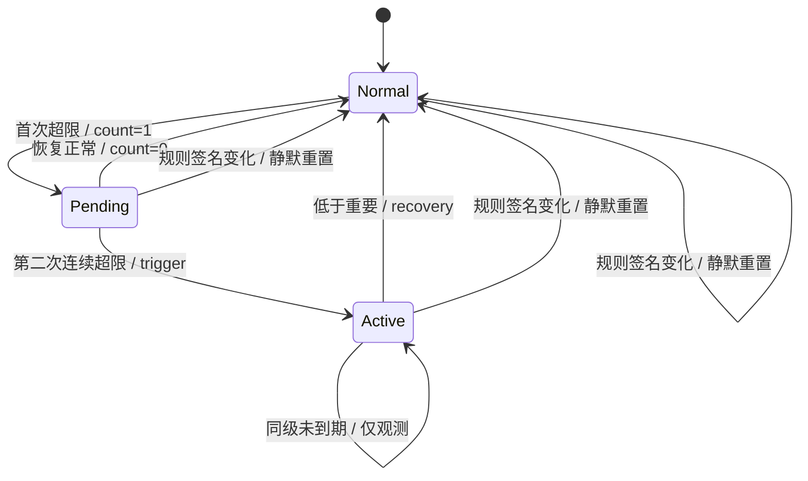
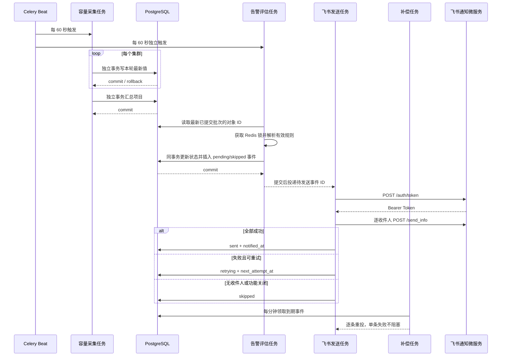
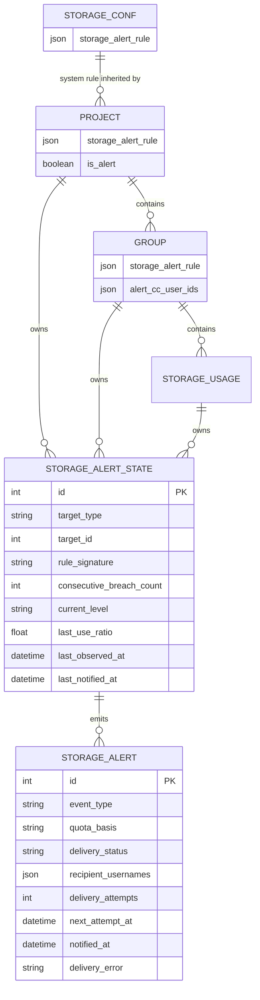

# 存储告警规则设计

> 状态：**已实现 / 自动化验证已执行**
> 设计基线：本地 `main` HEAD `ffe5d15`，2026-07-16
> 实际迁移：`000000000006_storage_alert_rules`

本文是存储容量告警的需求、实现和验收唯一来源。后端规则、状态机、独立 Celery Beat 评估、飞书 outbox/重试、迁移与接口，以及前端三个规则入口和告警筛选均已落地；真实 Redis/Celery/飞书、多数据库在线迁移和登录浏览器仍按第 19 节标记为待验收。

## 1. 背景与现状

当前容量采集由 Celery Beat 每 60 秒触发 `storages_schedule_fetching_task`。`run_collection_round` 为每个存储集群建立独立数据库事务，成功集群完成 PostgreSQL 最新值提交后再尝试写 QuestDB；随后 `finalize_project_totals` 在单独事务中汇总真正刷新成功的项目。

现有 `StorageAlert` 管理类提供固定阈值邮件逻辑，`storages.py` 中仍有用户、项目组和项目邮件任务，但对应 Beat 项均已注释。现有告警缺少规则继承、连续样本确认、可持久化状态、恢复事件、飞书发送状态和可靠重试。

本设计保留旧邮件代码和模板用于历史兼容，但不恢复旧容量邮件调度。新链路使用 PostgreSQL 本轮最新采集值，不读取 QuestDB 时间窗口平均值。

## 2. 目标、非目标、角色与术语

### 2.1 目标

- 支持系统、项目、项目组三级完整规则及明确继承。
- 对用户目录、项目组、项目统一执行确认、升级、降级、重复和恢复状态机。
- 由独立 Celery Beat 任务读取最新已提交采集批次并评估，通过统一飞书通知微服务可靠发送。
- 提供可审计的告警事件、发送状态、失败摘要及后台配置页面。
- 保证多集群部分失败时只评估本轮数据新鲜的对象。

### 2.2 非目标

- 不删除或重新启用旧容量邮件任务。
- 不新增 Python 或前端依赖，不实现短信、电话、邮件或自定义 Webhook。
- 不改造 QuestDB 历史指标，不按滑动窗口平均值判断。
- 不新增告警详情深加载、消息模板编辑器或人工重发接口。
- 不承诺 exactly-once；发送语义为至少一次。

### 2.3 角色

| 角色 | 能力 |
| --- | --- |
| 超级管理员 | 配置系统、项目、项目组规则和抄送用户；查看告警历史。 |
| 项目负责人 | 接收项目告警。 |
| 项目组负责人 | 接收项目组告警。 |
| 用户 | 接收本人用户目录告警。 |
| 存储管理员 | 通过 `super_admin_usernames` 在紧急告警或 debug 模式接收通知。 |

### 2.4 术语与告警对象

| 术语 | 含义 | 目标标识 |
| --- | --- | --- |
| 用户目录 | `StorageUsage` 表示的个人目录配额。 | `storage_usage:<id>` |
| 项目组 | `Group` 表示的项目组存储汇总。 | `group:<id>` |
| 项目 | `Project` 表示的跨集群项目汇总。 | `project:<id>` |
| 硬限额 | `limit`，硬口径使用率为 `used / limit × 100`。 | `quota_basis=hard` |
| 软限额 | `soft_limit`，软口径使用率为 `used / soft_limit × 100`。 | `quota_basis=soft` |
| 规则签名 | 规范化完整规则 JSON 的 SHA-256。 | `rule_signature` |

## 3. 编号需求与追踪矩阵

### 3.1 编号需求

| 编号 | 需求 |
| --- | --- |
| SA-R01 | 系统必须提供默认完整规则，项目和项目组可完整覆盖或以 `null` 继承。 |
| SA-R02 | 用户目录和项目组按“项目组 → 项目 → 系统”，项目按“项目 → 系统”解析规则。 |
| SA-R03 | 阈值必须严格递增，重复频次必须为正整数，口径只能为 `hard/soft`。 |
| SA-R04 | 初次超限连续两次才触发；首次采样只累计，第二次按当次实际级别发送。 |
| SA-R05 | 活动告警升级立即发送、降级静默、同级到期重复、恢复立即发送一次。 |
| SA-R06 | 规则签名变化静默重置状态，不制造恢复事件。 |
| SA-R07 | 软口径缺少有效软限额时跳过，禁止回退硬限额且不得修改状态。 |
| SA-R08 | 只评估本轮成功集群及真正刷新成功的项目。 |
| SA-R09 | 评估和事件同事务持久化；事务提交后才投递发送任务。 |
| SA-R10 | Redis 锁与数据库唯一约束共同避免并发重复评估。 |
| SA-R11 | 用户目录、项目组、项目分别发给本人、项目组负责人、项目负责人。 |
| SA-R12 | 全局 CC 覆盖全部事件；项目组 CC 仅覆盖该组用户目录和项目组事件。 |
| SA-R13 | 紧急事件除业务收件人外还必须包含存储管理员。 |
| SA-R14 | debug 模式用存储管理员替换业务/项目组收件人，再加入全局 CC。 |
| SA-R15 | 收件人清洗、去空、保序去重；完全无收件人时记为 `skipped`。 |
| SA-R16 | 飞书按 `/auth/token` 和 `/send_info` 富文本 `post` 协议发送，不泄露密钥。 |
| SA-R17 | 初次失败后 1、5、15 分钟各重试一次，全部失败标记 `failed`。 |
| SA-R18 | 告警列表支持事件类型、限额口径和发送状态筛选，公开响应过滤内部字段。 |
| SA-R19 | 系统、项目和项目组后台提供规则入口、继承预览和前端校验。 |
| SA-R20 | 新迁移支持升级、降级和历史回填，兼容 SQLite/PostgreSQL/MySQL。 |

### 3.2 需求—测试追踪矩阵

| 需求 | 已完成自动化测试 | 待执行人工验收 |
| --- | --- | --- |
| SA-R01～R03 | `test_rule_schema_accepts_complete_rule_and_rejects_invalid_contracts`、`test_rule_inheritance_uses_complete_nearest_override`、API schema 契约测试 | 三个表单分别保存自定义和继承规则。 |
| SA-R04～R07 | 状态机测试覆盖连续确认、清零、升级、静默降级、重复、恢复、规则变化和软限额缺失 | 连续修改真实采样值核对告警时间线。 |
| SA-R08～R10 | `test_collection_enqueues_alert_evaluation_only_after_collection_transaction`、本轮新鲜对象/重复样本/聚合项目评估测试 | 停止一个真实集群后核对未生成陈旧告警。 |
| SA-R11～R15 | 收件人参数化矩阵、项目组 CC 存在性与去重测试、评估集成测试 | debug、紧急、无负责人场景核对真实收件人。 |
| SA-R16～R17 | `httpx` mock 协议测试、重试间隔/最大次数和最终失败测试 | 测试微服务接收一条触发和一条恢复消息。 |
| SA-R18 | 公开 schema/筛选契约测试；前端告警列表字段与中文标签测试 | 告警页组合筛选、分页和中文标签。 |
| SA-R19 | `frontend/test/unit/storage-alert-rules.test.js` 的 8 个用例覆盖共享表单、三个入口、继承预览与 API 路径 | 超级管理员页面冒烟，普通用户不可见系统规则。 |
| SA-R20 | revision/schema、SQLite 在线升降级、SQLite/PostgreSQL/MySQL 离线 SQL 与默认 JSON 测试 | 预发布备份后升级、回滚演练。 |

## 4. 规则继承与完整覆盖

项目和项目组字段为 `null` 时继承；非 `null` 时必须提交完整规则，禁止字段级合并。这样可避免上级规则变化后产生难以解释的混合配置。

| 告警对象 | 第一优先 | 第二优先 | 最终兜底 |
| --- | --- | --- | --- |
| 用户目录 | 所属项目组规则 | 所属项目规则 | 系统规则 |
| 项目组 | 本项目组规则 | 所属项目规则 | 系统规则 |
| 项目 | 本项目规则 | — | 系统规则 |

API 响应返回持久化规则字段。前端项目表单从系统配置取得继承规则；项目组表单额外读取完整项目详情，按“项目规则存在则项目，否则系统”生成只读预览。写请求只提交持久化规则，服务端评估时再次解析有效规则，不信任客户端预览。

## 5. 阈值、频次、口径与校验

系统默认规则及统一 JSON：

```json
{
  "quota_basis": "hard",
  "important": {"threshold": 80, "repeat_hours": 24},
  "serious": {"threshold": 90, "repeat_hours": 6},
  "emergency": {"threshold": 95, "repeat_hours": 1}
}
```

校验规则：

- `quota_basis ∈ {hard, soft}`。
- 阈值为整数且 `0 < important < serious < emergency <= 100`。
- `repeat_hours` 为正整数；布尔值不得作为整数接收。
- 系统规则必须非空；项目/项目组只允许 `null` 或完整合法规则。
- JSON 多余字段返回 `422`；不合法配置不得写库。
- 使用率保留原始浮点值参与判断，显示时格式化，不用显示精度反推状态。

## 6. 启用条件与数据新鲜度

| 对象 | 启用条件 | 数据新鲜度条件 |
| --- | --- | --- |
| 用户目录 | 所属 `Group.enable_monitoring=true` 且 `User.is_alert=true` | 所属集群在本轮 `succeeded_clusters` 中，记录在本轮采集被更新。 |
| 项目组 | `Group.enable_monitoring=true` | 所属集群本轮成功，项目组汇总值由本轮数据刷新。 |
| 项目 | 活动状态且 `Project.is_alert=true` | `finalize_project_totals` 明确返回本轮真正刷新成功的项目 ID。 |

评估任务输入为本轮成功集群 ID、刷新项目 ID 和 `collected_at`。失败集群的对象不评估、不恢复、不增加连续次数。项目跨集群时保持一条项目告警，消息列出本轮组成项目汇总的全部成功集群；只有项目汇总刷新成功才评估。

## 7. 状态转换规则与矩阵

### 7.1 状态表

| 当前状态 | 新样本 | 动作 | 事件 | 新状态 |
| --- | --- | --- | --- | --- |
| 无活动告警，计数 0 | 低于重要 | 保持清零 | 无 | 无活动告警 |
| 无活动告警，计数 0 | 达到任一级别 | 计数置 1，记录比率 | 无 | 待确认 |
| 待确认 | 低于重要 | 清零 | 无 | 无活动告警 |
| 待确认 | 达到任一级别 | 按第二次实际级别激活并通知 | `trigger` | 活动告警 |
| 活动告警 | 高于当前级别 | 立即通知 | `escalation` | 更新为更高级别 |
| 活动告警 | 低于当前但仍达重要 | 静默更新 | 无 | 更新为较低级别 |
| 活动告警 | 同级且未到频次 | 仅更新观测 | 无 | 同级 |
| 活动告警 | 同级且达到频次 | 通知 | `repeat` | 同级 |
| 活动告警 | 低于重要 | 通知一次并清活动状态 | `recovery` | 无活动告警 |
| 任意状态 | 有效规则签名变化 | 静默重置计数、级别和通知时间 | 无 | 无活动告警 |
| 任意状态 | 软口径且软限额无效 | 完全跳过 | 无 | 原状态不变 |

“无效软限额”包括 `null`、零或负数。恢复事件保存恢复前等级、当前使用率和恢复采样时间。降级后若再次升高，因高于当前等级而立即产生 `escalation`。

### 7.2 状态机



## 8. 采集、评估、持久化与发送时序



飞书 HTTP 永远不在集群采集事务或状态持久化事务中执行。

## 9. 数据模型、索引与约束

### 9.1 ER 图



### 9.2 迁移字段

迁移 `000000000006_storage_alert_rules`：

- `storage_conf.storage_alert_rule`：非空 JSON，默认系统规则。
- `projects.storage_alert_rule`：nullable JSON；`projects.is_alert` 新默认 `true`，现有活动项目回填 `true`。
- `groups.storage_alert_rule`：nullable JSON；`groups.alert_cc_user_ids`：非空 JSON 用户 ID 数组，默认 `[]`。
- 新表 `storage_alert_states`：上图字段；唯一约束 `(target_type, target_id)`。
- 扩展 `storage_alerts`：`event_type`、`quota_basis`、`delivery_status`、`recipient_usernames`、`delivery_attempts`、`next_attempt_at`、`notified_at`、`delivery_error`。
- 历史记录回填 `event_type=trigger`、`quota_basis=hard`、`delivery_status=legacy`。
- 唯一约束 `uq_storage_alert_state_target(target_type,target_id)`，查询索引 `ix_storage_alert_state_target(target_type,target_id)`，以及待投递索引 `ix_storage_alert_delivery_due(delivery_status,next_attempt_at)`。

应用层校验 JSON 结构及用户 ID 存在性；数据库约束负责目标唯一和非空默认。收件人快照与错误摘要属于内部字段，不进入公开响应。

## 10. API 契约

### 10.1 系统配置

`GET /config/storage` 与 `PUT /config/storage` 增加：

```json
{
  "storage_alert_rule": {
    "quota_basis": "hard",
    "important": {"threshold": 80, "repeat_hours": 24},
    "serious": {"threshold": 90, "repeat_hours": 6},
    "emergency": {"threshold": 95, "repeat_hours": 1}
  }
}
```

接口继续由 `require_super_admin` 保护。公开响应沿用 `StorageConfPublic`，不得返回密码或 YAML `app_key`。

### 10.2 项目与项目组

项目现有 CRUD 写入/响应增加：

```json
{
  "is_alert": true,
  "storage_alert_rule": null
}
```

项目组现有 CRUD 写入/响应增加：

```json
{
  "storage_alert_rule": null,
  "alert_cc_user_ids": [12, 37]
}
```

项目组写 schema 使用 `extra="forbid"`，`alert_cc_user_ids` 必须为正整数、保序去重，并由 CRUD 校验用户存在，不存在返回 `422`。有效规则和来源不持久化为 API 字段：运行时由 `resolve_storage_alert_rule` 解析，页面预览由现有配置/项目详情接口组合得到。

### 10.3 告警列表

`GET /storage-alerts/` 保留数据库分页，新增查询参数：

| 参数 | 值 |
| --- | --- |
| `event_type` | `trigger/escalation/repeat/recovery` |
| `quota_basis` | `hard/soft` |
| `delivery_status` | `pending/retrying/sent/failed/skipped/legacy` |

公开单条响应增加 `event_type`、`quota_basis`、`delivery_status`，不返回 `recipient_usernames`、`delivery_error`、`notified_at`、Bearer Token 或配置密钥。

成功示例：

```json
{
  "content": [{
    "id": 9001,
    "alert_level": "emergency",
    "alert_type": "alert",
    "event_type": "escalation",
    "quota_basis": "soft",
    "delivery_status": "sent",
    "threshold": 95,
    "avg_use_ratio": 97.2,
    "related_id": 42,
    "related_type": "StorageUsage",
    "updated_at": "2026-07-16 15:10:00"
  }],
  "total": 1
}
```

校验失败示例：

```json
{
  "detail": [{
    "loc": ["body", "storage_alert_rule", "serious", "threshold"],
    "msg": "thresholds must satisfy 0 < important < serious < emergency <= 100",
    "type": "value_error"
  }]
}
```

权限：配置类写接口继续仅超级管理员；告警列表沿用当前登录权限和项目数据过滤，不因新增内部字段扩大数据可见范围。

## 11. 后台页面设计

- 系统设置已新增“存储告警规则”页签，路由通过 `hasRole('superadmin')` 限制；保存复用 `configApi`。
- 共享组件 `frontend/src/components/form/StorageAlertRuleForm.vue` 已由系统设置、项目编辑、项目组编辑复用，包含口径、三级阈值/频次和严格递增校验。
- 项目编辑已增加“项目告警”和“自定义告警规则”开关；关闭自定义时展示系统规则只读预览。
- 项目组编辑已增加自定义开关、项目/系统继承来源和 `RdUserSelect multiple` 个人抄送；编辑时调用 `projectApi.fetchById` 获取完整项目规则。
- 告警列表已增加事件类型、限额口径、发送状态筛选和中文标签，继续使用数据库分页，并兼容新 `related_info.context` 与历史结构。
- 表单从自定义切换到继承时提交 `storage_alert_rule=null`；切回自定义时使用默认完整规则作为编辑初值。

## 12. 收件人、CC、debug 与去重矩阵

### 12.1 收件人矩阵

| 对象/场景 | 主收件人 | 项目组 CC | 全局 CC | 存储管理员 |
| --- | --- | --- | --- | --- |
| 用户目录普通事件 | 用户 `rd_username` | 是 | 是 | 否 |
| 项目组普通事件 | 项目组负责人 `rd_username` | 是 | 是 | 否 |
| 项目普通事件 | 项目负责人 `rd_username` | 否 | 是 | 否 |
| 任意紧急事件 | 同上 | 按对象 | 是 | 是 |
| 任意恢复事件 | 同原对象 | 按对象 | 是 | 否 |
| debug=true | 业务和项目组收件人被替换 | 否 | 是 | 是 |

处理顺序：生成业务主收件人和适用的项目组 CC；紧急级别追加 `super_admin_usernames`；若 debug 则先替换为 `super_admin_usernames`；最后追加 YAML `cc_usernames`；对所有用户名执行 `strip`、去空、保序去重。

无主收件人但存在任一 CC 时正常发送；最终列表为空时事件直接 `skipped`。项目组 `alert_cc_user_ids` 必须关联现有用户，解析为其 `rd_username`。项目汇总不加入项目组 CC。

### 12.2 多收件人交付

统一微服务一次接收一个 `username`。发送任务为事件获取一次 Token，再按快照顺序逐个调用 `/send_info`；事件仅在全部成功后记为 `sent`。部分成功后失败的重试可能使已成功用户收到重复消息，这是至少一次语义的已知边界。

## 13. 飞书配置与协议

```yaml
feishu_notification:
  enabled: false
  base_url: https://feishu-notifier.example.com/api
  app: feishu_bot
  app_key: replace-with-secret
  timeout_seconds: 5
  tls_verify: true
  debug: false
  cc_usernames: []
```

- 默认关闭；`enabled=true` 时启动配置校验 `base_url/app/app_key` 非空、`timeout_seconds>0`。
- 复用已安装的 `httpx`，不新增依赖。
- 获取 Token：`POST {base_url}/auth/token`，JSON `{"app":"feishu_bot","app_key":"<secret>"}`。
- 发送：`POST {base_url}/send_info`，请求头 `Authorization: Bearer <token>`，JSON 为以下富文本 payload。
- `app_key` 只存在部署 YAML/密钥注入中，不写数据库、API、事件或日志；错误只保存截断、脱敏摘要。
- `tls_verify` 默认 `true`；设为 `false` 必须视为受控降级并由部署方承担风险。

## 14. 完整飞书 payload 示例

以下示例中每个收件人分别发送一份，抄送消息可在标题或首段标注“抄送信息”。容量统一使用 GB；采用口径突出显示，同时展示两种限额、已用量及两种使用率。

### 14.1 用户目录触发

```json
{
  "username": "zhangsan",
  "msg_type": "post",
  "title": "🟠 存储重要告警 | 用户目录使用率 82.4%",
  "paragraphs": [
    [{"tag":"text","text":"用户名：zhangsan"}],
    [{"tag":"text","text":"集群：beijing-netapp"}],
    [{"tag":"text","text":"项目组标签：芯片验证"}],
    [{"tag":"text","text":"项目组：verification-a"}],
    [{"tag":"text","text":"Linux 路径：/project/verification-a/zhangsan"}],
    [{"tag":"text","text":"采用口径：硬限额（重要阈值 80%）","style":["bold"]}],
    [{"tag":"text","text":"硬限额 100 GB / 已使用 82.4 GB / 使用率 82.4%"}],
    [{"tag":"text","text":"软限额 90 GB / 已使用 82.4 GB / 使用率 91.6%"}],
    [{"tag":"text","text":"事件：首次确认（已连续两次超过阈值）"}]
  ]
}
```

### 14.2 项目组升级

```json
{
  "username": "group_owner",
  "msg_type": "post",
  "title": "🔴 存储严重告警升级 | 项目组使用率 92.1%",
  "paragraphs": [
    [{"tag":"text","text":"集群：shanghai-isilon"}],
    [{"tag":"text","text":"项目组标签：训练平台"}],
    [{"tag":"text","text":"项目组：model-training"}],
    [{"tag":"text","text":"项目组 Linux 路径：/ifs/model-training"}],
    [{"tag":"text","text":"采用口径：软限额（严重阈值 90%）","style":["bold"]}],
    [{"tag":"text","text":"硬限额 5000 GB / 已使用 4144.5 GB / 使用率 82.9%"}],
    [{"tag":"text","text":"软限额 4500 GB / 已使用 4144.5 GB / 使用率 92.1%"}],
    [{"tag":"text","text":"事件：从重要升级为严重"}]
  ]
}
```

### 14.3 跨集群项目紧急告警

```json
{
  "username": "project_owner",
  "msg_type": "post",
  "title": "🚨 存储紧急告警 | 项目使用率 96.3%",
  "paragraphs": [
    [{"tag":"text","text":"项目：Falcon"}],
    [{"tag":"text","text":"集群：beijing-netapp、shanghai-isilon"}],
    [{"tag":"text","text":"采用口径：硬限额（紧急阈值 95%）","style":["bold"]}],
    [{"tag":"text","text":"硬限额 12000 GB / 已使用 11556 GB / 使用率 96.3%"}],
    [{"tag":"text","text":"软限额：未设置 / 已使用 11556 GB / 使用率：未设置"}],
    [{"tag":"text","text":"事件：从严重升级为紧急"}]
  ]
}
```

### 14.4 恢复通知

```json
{
  "username": "zhangsan",
  "msg_type": "post",
  "title": "✅ 存储告警恢复 | 用户目录使用率 74.0%",
  "paragraphs": [
    [{"tag":"text","text":"用户名：zhangsan"}],
    [{"tag":"text","text":"集群：beijing-netapp"}],
    [{"tag":"text","text":"项目组标签：芯片验证"}],
    [{"tag":"text","text":"项目组：verification-a"}],
    [{"tag":"text","text":"Linux 路径：/project/verification-a/zhangsan"}],
    [{"tag":"text","text":"恢复前级别：严重"}],
    [{"tag":"text","text":"采用口径：硬限额；当前使用率 74.0%","style":["bold"]}],
    [{"tag":"text","text":"硬限额 100 GB / 已使用 74 GB / 使用率 74.0%"}],
    [{"tag":"text","text":"软限额 90 GB / 已使用 74 GB / 使用率 82.2%"}],
    [{"tag":"text","text":"事件：使用率已低于重要阈值 80%"}]
  ]
}
```

## 15. 事务、并发、重入与投递语义

- `run_collection_round` 保持每集群独立事务；项目汇总保持独立事务。
- `finalize_project_totals` 返回刷新成功项目 ID；外层事务成功退出后才调用评估任务 `.delay(...)`。
- 评估按轮次获取 Redis 锁；拿不到锁则退出，不并发扫描同一轮。
- 每个对象通过 `(target_type,target_id)` 唯一约束保证单状态行；并发插入冲突时回滚当前对象并读取现有状态，不生成第二事件。
- 同一事务内更新状态并插入 outbox 告警事件；只有提交成功才异步发送。
- 发送任务可重入：仅领取 `pending/retrying` 且到期事件。数据库状态更新失败发生在 HTTP 成功之后时，补偿任务可能重复发送，这是已接受的极小概率风险。
- 补偿任务每分钟处理到期事件，使用有限批次和确定顺序；单条异常捕获后继续下一条。

## 16. 失败处理矩阵

| 场景 | 行为 | 状态影响 | 可观测性 |
| --- | --- | --- | --- |
| 飞书未启用 | 事件记录为 `skipped`，不发 HTTP | 告警状态照常推进 | INFO，不含密钥 |
| Token/发送超时或 5xx | 按 1、5、15 分钟重试 | 活动状态不回滚 | `retrying`、尝试次数、脱敏摘要 |
| 通知服务端口不可达 | 认证请求连接超时，按相同频次重试 | 活动状态不回滚 | TCP 探测失败、最终 `failed`；恢复服务监听、路由或防火墙后再验收 |
| 初次加三次重试均失败 | 停止自动重试 | 活动状态保留 | `failed` |
| 个别收件人失败 | 整个事件进入重试 | 可能重复发给已成功收件人 | 记录失败用户名的脱敏标识，不记录 Token |
| 无主收件人但有 CC | 正常发 CC | 正常推进 | `sent/retrying` |
| 完全无收件人 | 不调用飞书 | 正常推进 | `skipped` |
| 项目组负责人缺失 | 使用项目组 CC、全局 CC；均无则跳过 | 正常推进 | 警告日志 |
| 选择软口径但软限额缺失 | 跳过评估 | 状态完全不变 | 聚合计数日志，避免每分钟刷屏 |
| 单个集群采集失败 | 不评估该集群对象 | 不恢复、不累计 | 采集失败日志 |
| 全部集群失败 | 采集任务失败，不投递评估 | 全部状态不变 | Celery 失败 |
| 项目部分集群失败 | 仅在项目汇总被明确刷新时评估 | 避免陈旧合计 | 汇总日志列出刷新项目 |
| 规则非法 | API `422`，配置不落库 | 状态不变 | 安全错误响应 |
| Redis 锁不可用 | 当前轮不评估，由下一采集轮重试 | 状态不变 | ERROR/任务失败 |
| 数据库事务失败 | 状态和事件共同回滚 | 状态不变 | ERROR，不发送 |

## 17. 权限与安全

- 配置、项目、项目组写接口沿用超级管理员保护；普通用户不得通过直接访问路由修改规则。
- 告警查询继续执行登录校验和既有项目隔离；新增筛选字段采用枚举白名单。
- Pydantic 在信任边界校验规则、事件筛选和用户 ID；排序字段继续白名单，不拼接 SQL。
- `app_key`、Bearer Token、收件人快照、内部错误摘要不得进入公开 API。
- 日志仅记录事件 ID、对象类型/ID、状态、尝试次数和截断脱敏错误；禁止输出完整请求头、Token、密钥或消息收件人列表。
- `tls_verify=true` 为默认安全值；关闭时仅允许受控测试环境。
- 富文本元素由结构化 JSON 构建；设备、项目、路径和用户名只作为文本值，不接受客户端注入任意飞书标签。

## 18. 迁移、部署、禁用与回滚

### 18.1 升级

1. 备份业务数据库和部署 YAML。
2. 更新 YAML，但保持 `feishu_notification.enabled=false`。
3. 在 `backend` 执行 `alembic heads/history`，确认唯一前序 head `000000000005`。
4. 执行 `alembic upgrade head`，核对新列、状态表、索引和历史回填。
5. 部署后端和前端，重启 FastAPI、Celery worker 与 Celery Beat。
6. 从 worker 所在主机验证通知服务域名解析、TCP 端口和 `/auth/token` 可达；连接不通时不得仅通过增加超时时间掩盖故障。
7. 先在 `debug=true` 下启用飞书，验证 Token、触发和恢复消息只发存储管理员。
8. 确认告警列表发送状态和中文正文后关闭 debug，启用正式收件人。

飞书正文和告警列表使用中文对象、事件类型、限额口径和告警级别。用户目录上下文包含用户名、集群、项目、项目组标签、项目组和 Linux 路径；页面从结构化上下文生成摘要，因此历史英文 `description` 无需数据迁移。进入 `failed` 的事件不会自动重放，网络恢复后必须由运维确认收件人与重复风险再处理。

### 18.2 禁用

将 `feishu_notification.enabled=false` 并重启 worker；评估仍可记录事件，但发送标记 `skipped`。若要停止产生项目告警，可关闭项目 `is_alert`；用户目录/项目组按其监控开关控制。禁用不删除历史事件或状态。

### 18.3 回滚

1. 先将飞书关闭并停止 Beat/worker，避免旧代码消费新事件。
2. 回滚应用版本。
3. 如需结构回滚，执行 `alembic downgrade 000000000005`；该操作删除状态表和新字段，必须先备份告警事件。
4. 恢复旧 YAML 并重启服务。

降级必须恢复旧 `projects.is_alert` 默认值和删除新增索引/约束；历史告警原字段保留，新增投递元数据在结构降级时丢失。旧邮件调度始终保持关闭。

## 19. 测试、覆盖率与验收

### 19.1 TDD 层级

- 单元：规则规范化/签名/继承、状态机全部转换、收件人和消息格式。
- 服务：评估事务、Redis 锁、软限额缺失、跨集群项目、飞书协议和重试。
- API：系统/项目/项目组写入、权限、公开字段过滤、告警列表组合筛选。
- 迁移：SQLite upgrade/downgrade、历史回填；PostgreSQL/MySQL offline SQL。
- 前端：共享规则表单、系统设置、项目/项目组继承预览和告警列表。
- 集成人工：测试飞书微服务、Celery worker/Beat、部分集群失败和浏览器页面。

### 19.2 最终自动验证结果

```powershell
# 后端（复用主仓库 venv；均已执行）
D:\dev\DiskPulse\.venv\Scripts\python.exe -m pytest backend\test
D:\dev\DiskPulse\.venv\Scripts\python.exe -m coverage run -m pytest backend\test
D:\dev\DiskPulse\.venv\Scripts\python.exe -m coverage report
D:\dev\DiskPulse\.venv\Scripts\python.exe -m compileall -q backend
D:\dev\DiskPulse\.venv\Scripts\python.exe -m pip check

# 前端
Set-Location frontend
npm test
npm run test:coverage
npm run lint
npm run build:prod

# 迁移、源码和 CodeGraph（均已执行）
Set-Location ..\backend
D:\dev\DiskPulse\.venv\Scripts\python.exe -m alembic heads
D:\dev\DiskPulse\.venv\Scripts\python.exe -m alembic history
Set-Location ..
git diff --check
codegraph sync
codegraph status D:\dev\worktrees\DiskPulse\storage-alert-rules
```

结果：后端全量 `312 passed`，仓库 coverage 总计 `84%`，通过仓库现有 `80%` 门禁，但**未达到本计划要求的全局 90%**；规则 schema、规则服务和飞书服务选择性统计为 `92%`。前端全量 40 个测试文件、`205 passed`，Statements/Lines `92.62%`、Branches `81.96%`、Functions `70.29%`；`npm run lint` 和 `npm run build:prod` 通过。前端分支/函数覆盖率未达到文档参考的四项 90%，当前 Vitest 配置仍按仓库实际门禁通过。

迁移专项已验证 SQLite 在线完整 upgrade/downgrade，SQLite 离线 SQL 可执行 upgrade/downgrade，以及 PostgreSQL/MySQL 离线 SQL 生成与默认规则 JSON；Alembic 唯一 head 为 `000000000006`，history 连续。`compileall`、`pip check`、`git diff --check` 通过，CodeGraph 已同步并返回 `[OK] Index is up to date`。

### 19.3 开工基线

| 检查 | 2026-07-16 初始结果 | 收敛结果 |
| --- | --- | --- |
| `.codegraph` 重建 | 286 files / 3,866 nodes / 9,936 edges，新 Worktree 路径 | 通过 |
| `codegraph status` | `[OK] Index is up to date`（功能改动前） | 通过 |
| `npm ci` | 成功 | 通过 |
| Alembic | 唯一 head `000000000005`，history 连续 | 通过 |
| 后端全量 | `283 passed, 1 failed` | 基线修复提交 `d16e8f1` 后 `284 passed` |
| 前端全量 | `194 passed, 2 failed` | 基线修复提交 `d16e8f1` 后 39 个测试文件、`196 passed` |

初始后端失败为迁移测试错误选择最后一个迁移；初始前端失败为 `storage-resource-terminology.test.js` 仍断言已变更页面的“存储目标”和协议/TLS 摘要。两类基线问题已在独立提交 `d16e8f1` 修复并完成全量复验，准确证据见 `docs/tracking/error-log.md`。随后完成 RED 契约提交 `84b0d47` 和 GREEN 实现；上述 19.2 结果覆盖最终工作树。

### 19.4 人工验收

1. 超级管理员分别保存系统、项目和项目组规则，刷新后值与来源一致。
2. 普通用户不能看到系统规则页签，直接写接口返回拒绝。
3. 制造两次连续重要超限，第一次无事件、第二次出现 `trigger`。
4. 依次制造升级、静默降级、再次升级、到期重复和恢复，核对事件时间线。
5. 软口径对象无软限额时不产生事件且状态不变。
6. 核对用户、项目组、项目、紧急、恢复和 debug 收件人矩阵。
7. 模拟飞书失败，核对 1/5/15 分钟重试、最终 `failed` 及其他事件不阻塞。
8. 停止一个集群采集，确认失败集群对象不恢复、不累计；跨集群项目只在成功刷新后评估。
9. 告警列表组合筛选、翻页后总数与数据库一致，无内部字段泄露。

尚未验证：真实飞书微服务、真实 Redis/Celery worker/Beat 消费、真实 PostgreSQL/MySQL 在线升降级、真实多集群部分失败，以及登录态浏览器人工冒烟。现有 mock、SQLite 和离线 SQL 不能替代这些部署环境验收。

## 20. CodeGraph 探索证据、关键决策与已知限制

### 20.1 探索证据

| 查询 | 命中与调用链 | 设计决策 |
| --- | --- | --- |
| `storages_schedule_fetching_task run_collection_round finalize_project_totals` | `storageClusterService.schedule_storage_collection → storages_schedule_fetching_task`；每集群 `db.begin()`，项目汇总另有 `db.begin()` | 采集只负责提交最新值和项目汇总，不再投递告警任务；独立 Beat 从最新共同时间戳选择已提交对象。 |
| `StorageUsage Group Project StorageAlerts StorageConf` | 命中现有 ORM、schema、CRUD 和路由；实施前 `Project.is_alert` 默认 false | `000000000006` 已增加规则/状态/投递字段，并将新项目默认及活动项目回填改为 true。 |
| `StorageAlert legacy email Celery beat` | 旧管理类在 `storages.py` 有 5 个调用方；容量邮件 Beat 项已注释 | 保留旧代码和模板，不恢复调度。 |
| `SettingsPage ProjectFormDialog GroupFormDialog AlertListPage` | 设置页调用 `configApi`；项目/项目组沿用共享 CRUD 表单；`RdUserSelect` 已支持多选 | 已复用现有 API 和组件模式，仅新增 `StorageAlertRuleForm` 与规则默认值工具。 |
| `config storage storage_alerts` | `/config/storage` 已由 `require_super_admin` 保护；告警列表已有数据库分页 | 扩展既有契约，不新建平行接口，不做详情深加载。 |
| `celery_worker beat schedule` | 容量采集每 60 秒；旧邮件任务未启用 | 已注册每分钟 `storage_alerts_schedule_task`、发送任务和每分钟 `retry_storage_alerts_task`，采集事务不执行告警评估或 HTTP。 |
| Alembic revision | 探索时唯一 head `000000000005` | 实际新增 `000000000006_storage_alert_rules`，最终唯一 head 为 `000000000006`。 |

共享模型、任务、CRUD、schema 和 Vue 组件修改前已执行 `codegraph impact`；RED、GREEN 和最终验证阶段均同步索引，并用 `codegraph affected` 选择聚焦测试。最终状态为 `[OK] Index is up to date`。

### 20.2 实际实现落点

| 层级 | 实际文件/符号 |
| --- | --- |
| 规则与状态机 | `backend/schemas/storageAlertRuleSchema.py`、`backend/services/storageAlertRuleService.py` |
| 模型与迁移 | `backend/models.py`、`backend/migrate/versions/000000000006_storage_alert_rules.py` |
| 采集接入 | `backend/celery_tasks/tasks/storages.py`、`backend/celery_tasks/manager/storagePulseMonitor.py` |
| 评估与 outbox | `storage_alerts_schedule_task`、`deliver_storage_alert_task`、`retry_storage_alerts_task`，位于 `backend/celery_tasks/tasks/storage_alerts.py`；Beat 配置位于 `backend/celery_worker.py` |
| 飞书协议 | `backend/services/feishuNotificationService.py`、`backend/appConfig.py`、`backend/config.example.yml` |
| API 契约 | 配置、项目、项目组、告警的既有 router/CRUD/schema；公开告警 schema 过滤投递内部字段 |
| 前端 | `StorageAlertRuleForm.vue`、`SettingsPage.vue`、`ProjectFormDialog.vue`、`GroupFormDialog.vue`、`AlertListPage.vue` |
| 测试 | `backend/test/test_storage_alert_rules.py` 29 个功能用例；`frontend/test/unit/storage-alert-rules.test.js` 8 个 UI/API 契约用例 |

### 20.3 关键决策

- 使用现有 `storage_alerts` 作为事件/outbox，避免额外投递表。
- 使用现有 Redis 锁和数据库唯一约束，不引入新协调组件。
- 状态机直接消费 PostgreSQL 最新样本，避免 QuestDB 可用性影响告警。
- 完整规则覆盖而非字段级合并，保证继承来源可解释。
- 多收件人逐个调用现有微服务协议，接受部分成功后的极小重复风险。

### 20.4 已知限制

- 至少一次而非 exactly-once；HTTP 成功后进程崩溃可能重复通知。
- 一个事件只有聚合交付状态，不能展示每个收件人的独立成功状态。
- 规则变更会静默清除活动状态，下一次超限需重新连续确认两次。
- 软限额缺失时不会告警；管理员必须补全软限额或改用硬口径。
- 当前仅容量告警接入飞书，设备事件、性能事件、大文件和备份通知不在范围内。
- 后端全局覆盖率为 `84%`，前端 Branches/Functions 分别为 `81.96%`/`70.29%`，均未达到本设计期望的四项 90%；核心后端选择性覆盖率和前端 Statements/Lines 已超过 90%。
