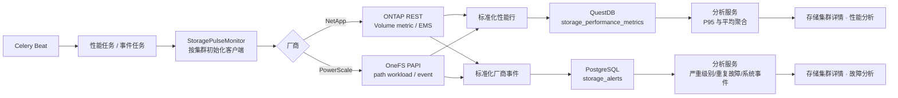
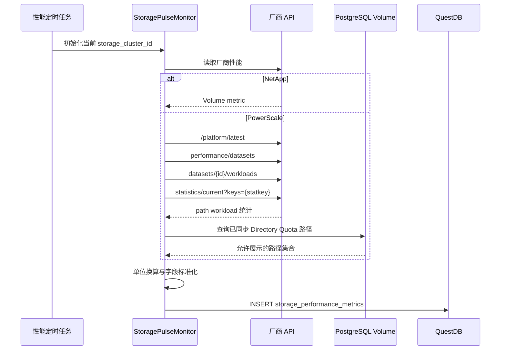
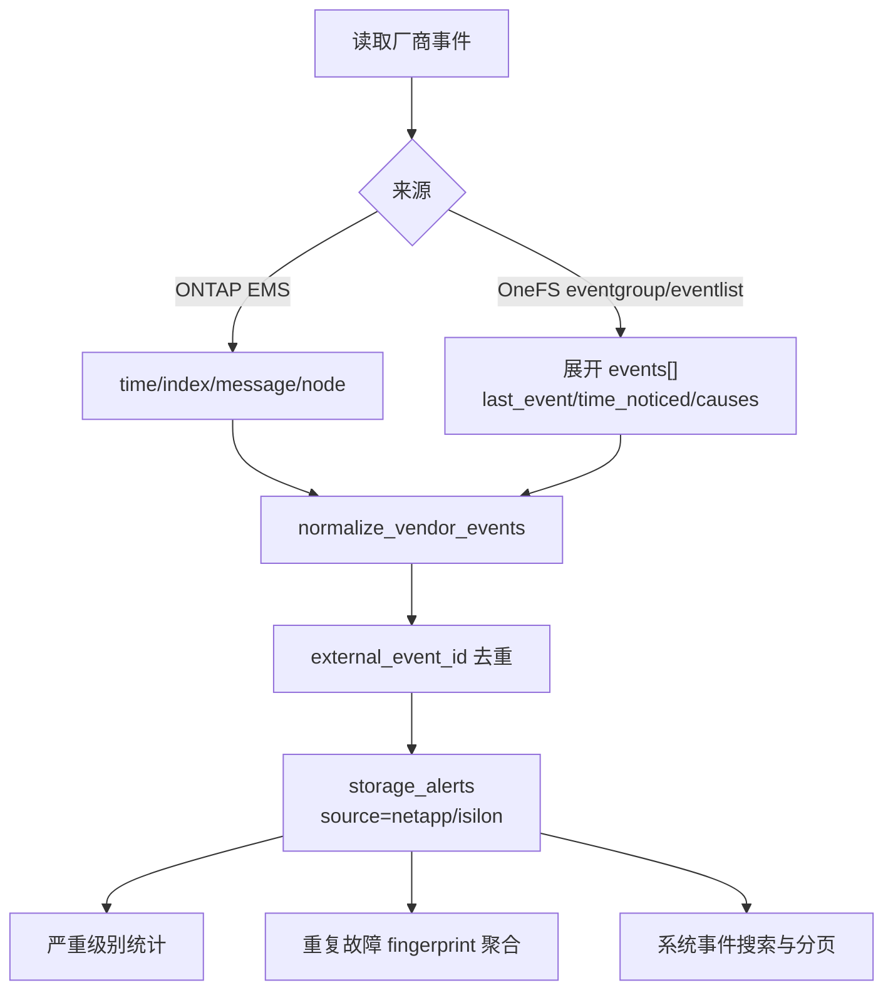

# 存储性能与厂商事件采集设计

## 1. 目标与边界

本专题说明 DiskPulse 如何将 NetApp ONTAP Volume 与 PowerScale（Isilon）Directory Quota 的性能数据、厂商事件统一采集、存储和展示。目标是让“存储空间”成为性能分析的共同对象，而不是把节点级指标误标为目录或 Volume 指标。

范围包括：性能/事件采集、标准化、QuestDB/PostgreSQL 存储、存储集群详情页分析、导出和排障边界。不包含设备配置写入、告警自动修复和历史性能回灌。

## 2. 总体架构

两个定时任务均通过 Redis 锁防止并发重复执行；单个集群失败由 `run_isolated` 记录为失败结果，不阻断其他集群。性能任务最长 300 秒，事件任务最长 60 秒。

## 3. 为什么这样设计

| 设计选择 | 原因 | 明确不做的事 |
| --- | --- | --- |
| 以 `Volume`/Directory Quota 为统一对象 | NetApp 的 Volume 与 PowerScale 的 Directory Quota 都是可分配的逻辑存储空间，能与项目组、容量和前端对象名称一致。 | 不把 PowerScale 节点磁盘延迟显示成目录延迟。 |
| PowerScale 只使用 `path` dataset 的固定 workload | OneFS 性能 dataset 返回的是 workload ID；必须用 workload API 映射回完整路径，才能准确关联 Directory Quota。 | 不按容量、IOPS 或节点指标猜测未固定路径的延迟。 |
| 采集时统一换算、查询时再聚合 | 设备原始采样单位和字段形态不同，入库先统一为毫秒、IOPS、B/s，页面再按时间范围计算 P95/均值/最大值。 | 不在前端拼接厂商私有字段。 |
| 厂商事件进入 `storage_alerts`，保留 `source` | 既可复用统一的严重级别、时间范围、分页能力，也能把 DiskPulse 容量告警和厂商原生日志分开呈现。 | 不把厂商事件误显示为扩容、周报等业务告警。 |
| 无数据时返回空集或 `supported=false` | “尚未采集”“权限不足”“所选时间无数据”语义不同，不能用虚构零值掩盖采集问题。 | 不因设备接口失败生成零延迟或空事件。 |

## 4. 性能采集流程

### 4.1 统一性能字段

表 `storage_performance_metrics` 保留 180 天。性能分析使用下面字段，设备原始响应不直接暴露给页面。

| 字段 | 单位 | 含义 | 页面指标 |
| --- | --- | --- | --- |
| `latency_total` | ms | 总请求平均延迟 | P95、平均、最大延迟 |
| `latency_read` | ms | 读请求平均延迟 | 平均读延迟 |
| `latency_write` | ms | 写请求平均延迟 | 平均写延迟 |
| `iops_total` | IOPS | 总操作速率/总 protocol ops | 平均 IOPS |
| `throughput_total` | B/s | 总吞吐量 | 平均吞吐量 |
| `collected_at` | 设备采集时间 | 时间范围聚合依据 | 所有性能筛选 |

PowerScale 的 `latency_read`、`latency_write`、`latency_other` 是 `sum/count` 计数器：采集器先对三类计数合并计算总延迟，再从微秒转换为毫秒。`protocol_ops`（兼容旧响应 `ops`）写入 `iops_total`；`bytes_in + bytes_out` 写入 `throughput_total`。字段缺失保持 `null`，不伪造 `0`。

### 4.2 页面分析行为

性能分析接口默认按 `p95_latency` 降序返回 10 个对象，`limit` 可到 100。页面可选择 10、20、50、100 条，并多选指标：P95、平均、最大、读、写延迟、IOPS、吞吐量。不同单位独立成图，避免将 ms、IOPS、B/s 堆叠在同一 Y 轴。

数据对象固定过滤为 `object_type=volume`，PowerScale 额外使用当前 PostgreSQL `Volume.name` 进行路径白名单校验。因此历史错误节点样本或未同步的父目录不会出现在页面。

## 5. 事件采集与分析

首次采集回看最近 24 小时；后续从最新入库事件向前回看 5 分钟，利用厂商事件 ID 去重。事件标准化至少要求可识别的事件 ID、发生时间和严重级别；不完整记录只写服务端诊断日志，不进入分析。

`fingerprint` 使用 `厂商:事件代码:对象类型:对象 ID`，刻意不使用动态正文，以便“重复故障”聚合稳定。系统事件按 `keyword`、`severity` 过滤后再做数据库分页，默认 20 条/页。

## 6. 运行与安全边界

- API 访问统一受 DiskPulse `Authorization: Bearer <token>` 保护；存储集群详情与分析接口沿用登录用户访问边界。
- OneFS 推荐使用 System Zone 的本地只读服务账号和 `DiskPulseMonitor` 角色；长期使用个人 NIS/LDAP/AD 账号会引入身份映射与权限漂移风险。
- OneFS Session 默认不缓存；选择文件或 Redis 缓存时，Cookie 与 CSRF Token 不进入数据库，必须限制缓存文件 ACL 和 Redis 网络访问。
- HTTPS 默认启用 TLS 证书校验；无法验证的证书应通过受控 CA 配置处理，不应在代码中全局关闭校验。
- 真机权限、已固定 workload、Celery worker/Beat 运行状态与数据库最新时间戳必须共同验收；仅凭前端空态或 `celery inspect` 超时不能判断采集失败。

## 7. 关联文档

- [厂商接口与 DiskPulse API 契约](./vendor-api-contracts.md)
- [部署排障与验收手册](../../guides/storage-performance-event-troubleshooting.md)
- [健康分析页面、导出与空态说明](./health-analytics.md)
