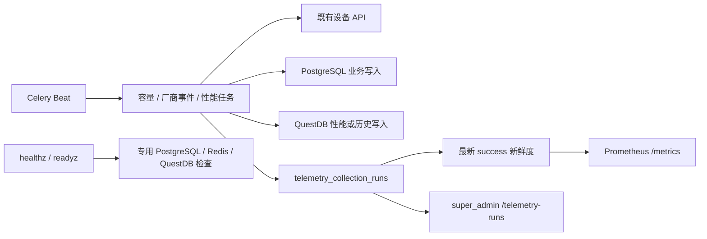

# 遥测新鲜度与平台可观测设计复盘

## 目标

本专题用独立运行账本回答“某个活跃存储集群的容量、厂商事件或性能采集最后一次结果是什么、是否新鲜”，不再用 `StorageCluster.updated_at` 或日志推断采集健康。

设计边界保持明确：不增加设备 API 调用、不阻塞既有采集、不写既有业务域表、不引入 OTel、日志平台、RCA、预测、前端大屏或 API 对 Celery inspect 的依赖。账本是系统运行记录，不逐行生成统一审计事件；`trace_id`、安全任务日志、账本和聚合指标共同提供追溯。

## 架构与数据流

- 任务每次尝试都从 Celery `request.id`、`request.retries + 1` 和合法任务头 `trace_id` 建立执行上下文；不增加自动重试。
- 每个集群/组件运行创建独立 UUID `run_id`，账本起止写入使用独立短事务。账本写入失败仅写安全日志，不覆盖采集失败或阻塞后续集群。
- 成功语义严格与数据面提交绑定：容量为 PostgreSQL 提交；厂商事件为 PostgreSQL 事件提交；性能为 QuestDB 提交。容量后的尽力 QuestDB 历史写入失败不影响容量成功。
- `/metrics` 先更新依赖 Gauge，再以专用 `pool_size=1` PostgreSQL engine 读取活跃集群和各组件的最新成功记录；该 engine 在单次抓取结束时关闭，不复用应用业务连接池。

## 运行账本契约

`telemetry_collection_runs` 由 Alembic `000000000008` 建立，主键为 UUID `id`（即运行 ID）。关键约束如下：

| 范围 | 约束 |
| --- | --- |
| 任务幂等 | `(task_id, attempt, component, scope_key)` 唯一；重试递增 `attempt`，保留历史。 |
| 作用域 | `cluster` 使用非空集群 ID 字符串 `scope_key`；锁冲突使用 `scheduler/scheduler` 且无集群外键。 |
| 生命周期 | 运行中 `outcome`、结束时间和终态字段均为空；结束后 `success` 必须带 `data_state` 与 `records_written`，`failed/skipped` 的数据字段及 `error_code` 为空。 |
| 状态集合 | 组件固定为 `capacity`、`vendor_events`、`performance`；成功数据状态固定为 `data`、`empty`、`unsupported`；错误码字段仅允许既定标准集合。 |
| 保留与查询 | 集群外键 `ON DELETE SET NULL`，`scope_key` 留存；有组件/集群/结束时间降序索引和 `created_at` 清理索引。 |

所有账本时间经 UTC-aware 类型归一化。`records_written=0` 是成功的 `empty`；只有设备明确不支持时才为 `unsupported`。401/403 归类为 `vendor_auth`，超时为 `vendor_timeout`，PostgreSQL 和 QuestDB 阶段错误分别归类，其他情况为 `unknown`；账本不保存地址、路径、用户、原始异常或凭据。

## 新鲜度与接口设计

新鲜度只读取活跃集群每个组件最新的 `success`：容量/厂商事件不超过 150 秒为 `fresh`，性能不超过 630 秒为 `fresh`；从未成功为 `unknown`，超过阈值为 `stale`，`empty` 仍为新鲜。

| 接口 | 责任与安全边界 |
| --- | --- |
| `GET /storage-pulse/api/v1/healthz` | 无认证，固定 `200 {"status":"ok"}`；在 session middleware 前短路，不访问数据库。 |
| `GET /storage-pulse/api/v1/readyz` | 无认证，专用 1 秒 PostgreSQL/QuestDB `SELECT 1` 和 Redis `PING`；PostgreSQL 或 Redis 失败为 `503 not_ready`，仅 QuestDB 失败为 `200 degraded`。 |
| `GET /storage-pulse/api/v1/metrics` | 文件 Token 经 `hmac.compare_digest` 比较；任一缺失、读取失败或不匹配固定 `403`；网络层仅允许监控网段。 |
| `GET /storage-pulse/api/v1/telemetry-runs` | `super_admin` 只读；先经过认证/权限链，支持组件、集群、UTC 时间范围和数据库分页；响应不包含 task ID、设备信息或原始异常。 |

指标只定义约定内的 HTTP Counter/Histogram、依赖就绪 Gauge、遥测新鲜度/状态/最后成功时间 Gauge。HTTP 标签只含方法、模板路由、状态码；其余只含组件和集群 ID，避免高基数和敏感标签。

## 运维取舍

- 每日 03:17（Celery 当前时区）清理超过 90 天的账本，Redis 单例锁 30 分钟，按 1,000 条批量提交。失败时向配置的飞书 `cc_usernames` 发送无敏感摘要；无通知配置时任务仍失败并在下日重试。
- Prometheus scrape job、告警表达式和网络 CIDR 属于部署环境，不在仓库内固化。上线后先暗运行 7 天，仅观察 `not_ready`、`stale` 与账本一致性，再启用既有通知体系的告警。
- Worker 心跳和队列深度继续由独立 `celery-exporter` 采集，避免 API 拉取 Celery 控制面。
