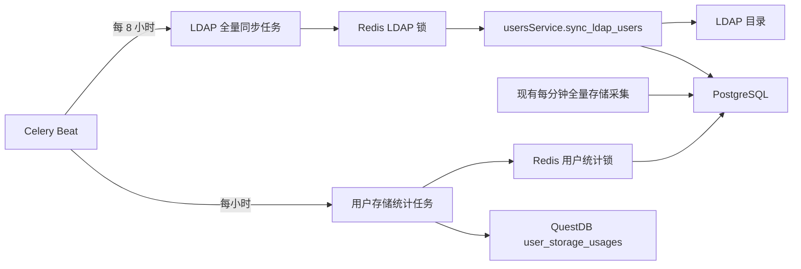

# LDAP 定时同步与用户存储统计设计

> 状态：已批准设计，待实现。本文描述后端定时任务、数据聚合和 QuestDB 表结构，不代表功能已经上线。

## 1. 背景与目标

DiskPulse 已提供人工触发的 LDAP 全量用户同步，并通过每分钟执行的存储采集任务更新 PostgreSQL `storage_usages`。本次变更在不改变现有人工入口和存储采集行为的前提下，新增两类 Celery 周期任务：

- 每 8 小时执行一次 LDAP 全量用户同步，使用户资料和在职状态不再依赖人工触发。
- 每小时按用户维度汇总 PostgreSQL 当前 `StorageUsage` 数据，并把同一采样时刻的用户级存储指标写入新的 QuestDB 时序表。

本设计的成功结果是：LDAP 同步复用现有业务语义且可防止重复执行；用户存储统计可稳定产出按用户聚合的历史样本，空数据和写入失败均具有明确、可观测的任务结果。

## 2. 范围

### 2.1 本次范围

- 在 Celery Beat 中注册 LDAP 全量同步任务，调度间隔为 8 小时。
- LDAP 任务复用 `usersService.sync_ldap_users`，使用任务内创建的独立 PostgreSQL 会话和 Redis 非阻塞锁。
- 保持现有 `storages_schedule_fetching_task` 每 60 秒执行的全量存储采集流程不变。
- 新增每小时用户存储统计任务，从 PostgreSQL 当前 `StorageUsage` 行按 `user_id` 汇总并写入 QuestDB。
- 新增 QuestDB 用户级时序模型和前向 SQL revision。
- 为调度、锁、事务、聚合计算、空数据和 QuestDB 失败路径补充后端测试。

### 2.2 不在本次范围

- 不新增或修改前端页面、路由和交互。
- 不新增查询 API，也不修改现有用户或存储接口契约。
- 不改变人工 `POST /storage-pulse/api/users/sync-ldap` 的鉴权与响应。
- 不改变 LDAP 完整快照为空、查询失败、用户名冲突时的既有回滚和错误语义。
- 不改变每分钟存储采集的设备访问、PostgreSQL 更新或现有 QuestDB 明细写入流程。
- 不回填历史用户聚合数据；新表只记录功能上线后的周期样本。
- 不在 Web 服务、Worker 或 Beat 启动时立即执行任一新增任务。

## 3. 现状与约束

- `backend/services/usersService.py` 中的 `sync_ldap_users(db)` 已负责 LDAP 完整快照获取、忽略大小写的用户名匹配、用户新增/更新/恢复/离职标记，以及成功提交和异常回滚。
- `backend/celery_worker.py` 已配置 `Asia/Shanghai` 时区，现有 `storages_schedule_fetching_task` 的 `schedule` 为 `60.0` 秒。
- `backend/celery_tasks/tasks/redis_lock.py` 提供 Redis 非阻塞锁；未获得锁时任务应跳过，不等待，也不并发执行相同业务。
- PostgreSQL `StorageUsage` 是当前用户目录数据源，容量字段为 `limit`、`soft_limit`、`used`，文件数使用量字段为 `file_used`。
- QuestDB schema 由 `backend/questdb/migrations/` 的项目内前向 revision 管理，不归 PostgreSQL Alembic 管理。

## 4. 总体架构



两个新增任务独立调度、独立加锁、独立创建和关闭数据库会话。LDAP 同步只写 PostgreSQL；用户统计只读取 PostgreSQL 当前快照并向 QuestDB 追加时序样本。两者不嵌入现有每分钟存储采集任务，避免存储设备采集失败或耗时影响 LDAP，同样避免 QuestDB 用户聚合失败改变 PostgreSQL 当前值。

## 5. 组件设计

### 5.1 Celery Beat 调度

在 `backend/celery_worker.py` 的 `beat_schedule` 中新增两个独立条目：

| 调度项 | Celery task | 周期 | 过期策略 |
| --- | --- | --- | --- |
| `ldap_users_sync_schedule_task` | `celery_tasks.tasks.users.ldap_users_sync_schedule_task` | `28800.0` 秒 | `expires=28800` |
| `user_storage_statistics_schedule_task` | `celery_tasks.tasks.storages.user_storage_statistics_schedule_task` | `crontab(minute="0")` | `expires=3600` |

Beat 启动后只按周期投递，不使用启动钩子、`delay()` 或其他立即执行路径。LDAP 的首次执行发生在 Beat 计时到 8 小时后；用户统计在下一个整点执行。现有 `storages_schedule_fetching_task` 的任务名、`60.0` 秒周期和 `expires=120` 保持不变。

### 5.2 LDAP 定时同步任务

新增 `backend/celery_tasks/tasks/users.py`，定义 `ldap_users_sync_schedule_task`。执行顺序如下：

1. 尝试获取 Redis 非阻塞锁 `ldap_users_sync_schedule_task_lock`，锁超时为 8 小时。
2. 未获得锁时记录跳过日志并正常返回，不创建数据库会话，也不调用 LDAP。
3. 获得锁后通过 PostgreSQL `SessionLocal` 创建任务专用会话。
4. 调用现有 `usersService.sync_ldap_users(db)`，不复制或改写同步业务规则。
5. 成功时记录 `ldap_total`、`created`、`updated`、`reactivated`、`marked_inactive` 统计并返回可序列化结果。
6. 失败时保留 `sync_ldap_users` 的回滚和异常行为，任务记录异常并重新抛出，使 Celery 将本次执行标记为失败。
7. `finally` 中关闭数据库会话；退出锁上下文时释放 Redis 锁。

任务不增加额外提交。LDAP 快照不可用或为空时仍由 `sync_ldap_users` 回滚并失败；用户名冲突仍整体回滚；其他数据库或 LDAP 异常仍不得被转换为成功。

### 5.3 用户存储统计聚合服务

新增后端聚合函数，由 `user_storage_statistics_schedule_task` 调用。每次执行只查询 PostgreSQL 当前 `StorageUsage` 行，按非空 `user_id` 分组，聚合规则如下：

| QuestDB 字段 | 来源与计算 |
| --- | --- |
| `user_id` | PostgreSQL `StorageUsage.user_id` 分组键。 |
| `limit` | 组内 `StorageUsage.limit` 的和，空值按 `0` 处理。 |
| `soft_limit` | 组内 `StorageUsage.soft_limit` 的和，空值按 `0` 处理。 |
| `used` | 组内 `StorageUsage.used` 的和，空值按 `0` 处理。 |
| `use_ratio` | `used / limit * 100`，保留两位小数；`limit <= 0` 时为 `0`。 |
| `soft_use_ratio` | `used / soft_limit * 100`，保留两位小数；`soft_limit <= 0` 时为 `0`。 |
| `file_used` | 组内 `StorageUsage.file_used` 的和，空值按 `0` 处理。 |
| `updated_at` | 本轮任务开始时生成一次的采样时间；同一轮所有用户共用该值。 |

聚合跨项目组、存储集群和用户目录进行，只保留用户维度。这样同一用户在多个 `StorageUsage` 行上的容量和文件使用量会合并成一个时序样本。`user_id IS NULL` 的行不参与用户统计，因为无法归属于有效用户。

聚合读取使用独立 PostgreSQL 会话，不修改 PostgreSQL 数据，也不提交事务。查询结果必须先完整转换为待写入样本，再打开 QuestDB 会话批量写入，避免数据库会话或 ORM 延迟加载跨边界使用。

### 5.4 QuestDB 数据模型

在 `backend/questdb/models.py` 新增 `UserStorageUsage`，表名为 `user_storage_usages`：

| 字段 | QuestDB 类型 | 约束/用途 |
| --- | --- | --- |
| `user_id` | `SYMBOL` | 用户标识，与 `updated_at` 组成逻辑主键。 |
| `limit` | `DOUBLE` | 用户硬限额汇总。 |
| `soft_limit` | `DOUBLE` | 用户软限额汇总。 |
| `used` | `DOUBLE` | 用户已用容量汇总。 |
| `use_ratio` | `DOUBLE` | 用户硬限额使用率。 |
| `soft_use_ratio` | `DOUBLE` | 用户软限额使用率。 |
| `file_used` | `DOUBLE` | 用户已用文件数汇总。 |
| `updated_at` | `TIMESTAMP` | 指定时间列，与 `user_id` 组成逻辑主键。 |

表使用 `QDBTableEngine`，按 `updated_at` 指定时间列、按天分区并启用 WAL，与现有容量时序表保持一致。表结构通过新的 `backend/questdb/migrations/` 前向 SQL revision 创建；不修改既有 revision，不使用 Alembic，也不在运行时执行临时建表。

### 5.5 用户存储统计任务

`user_storage_statistics_schedule_task` 的执行顺序如下：

1. 尝试获取 Redis 非阻塞锁 `user_storage_statistics_schedule_task_lock`，锁超时为 1 小时。
2. 未获得锁时记录跳过日志并正常返回。
3. 获得锁后生成唯一的本轮 `updated_at`，创建独立 PostgreSQL 会话并执行用户维度聚合。
4. 聚合结果为空时不打开 QuestDB 写事务，记录成功日志并返回 `count=0`。
5. 聚合结果非空时创建独立 QuestDB 会话，批量新增所有 `UserStorageUsage` 样本并提交一次。
6. QuestDB 提交成功后返回写入用户数 `count` 和本轮采样时间。
7. 任一 QuestDB 写入或提交失败时回滚 QuestDB 会话，记录带异常堆栈的错误日志并重新抛出，Celery 任务必须显示为失败，不能返回 `count=0` 或其他成功结果。
8. `finally` 中分别关闭已创建的 PostgreSQL 和 QuestDB 会话，并释放 Redis 锁。

本任务不依赖同一整点是否刚完成存储设备采集。它读取执行时 PostgreSQL 已提交的最新 `StorageUsage` 当前值，因此获得的是一致的当前快照语义，而不是强制与某一次设备采集绑定。

## 6. 数据流

### 6.1 LDAP 同步

1. Celery Beat 每 8 小时投递任务。
2. Worker 获取 Redis 锁。
3. 任务创建独立 PostgreSQL 会话。
4. `sync_ldap_users` 获取 LDAP 完整快照并在一个事务中应用用户变化。
5. 成功时提交并返回统计；失败时完整回滚并让任务失败。
6. 任务关闭会话并释放锁。

### 6.2 用户存储统计

1. 现有任务继续每分钟从存储设备更新 PostgreSQL `StorageUsage`。
2. Celery Beat 在每个整点投递用户统计任务。
3. Worker 获取用户统计专用 Redis 锁并生成本轮统一采样时间。
4. PostgreSQL 查询按 `user_id` 汇总所有当前 `StorageUsage` 行。
5. 空结果直接成功返回 `count=0`；非空结果转换为 QuestDB 样本。
6. QuestDB 在单次事务中写入本轮全部用户样本；成功提交后返回实际写入数。

## 7. 锁、事务与错误处理

### 7.1 锁边界

- 两个新增任务使用不同锁名，彼此以及现有存储采集任务不会互相阻塞。
- 锁采用非阻塞获取。Beat 重复投递、Worker 重启后旧消息延迟消费或上一次任务尚未结束时，后续实例跳过。
- 锁超时分别覆盖完整调度周期：LDAP 为 8 小时，用户统计为 1 小时。任务超过锁超时仍未结束时存在并发风险，应通过任务耗时和锁失效日志告警处理，而不是在本次设计中引入自动续租。

### 7.2 PostgreSQL 事务

- LDAP 任务完全委托 `sync_ldap_users` 管理提交和回滚，任务层不得吞掉异常或二次提交。
- 用户统计任务只读 PostgreSQL；会话与 Web 请求、LDAP 任务、存储采集任务完全隔离。
- 任一任务无论成功、跳过或失败，都必须关闭自己创建的会话。

### 7.3 QuestDB 事务

- 一轮用户统计的所有样本在一个 QuestDB 会话中批量新增并提交一次。
- 提交失败必须回滚、记录异常并重新抛出，使监控可通过 Celery 失败状态和日志发现问题。
- 不设计 PostgreSQL 与 QuestDB 的分布式事务。用户统计只读 PostgreSQL，QuestDB 写失败不会影响 PostgreSQL 当前数据；下一小时可根据当时当前值产生新样本。

### 7.4 可观测性

日志至少包含任务名、是否获得锁、开始/结束时间、耗时和结果计数。LDAP 成功日志包含同步统计；用户统计成功日志包含 `count` 和采样时间。失败日志使用 `logger.exception` 保留堆栈，但不得记录 LDAP 凭据、QuestDB 密码或完整用户资料。

## 8. 测试设计

实现必须遵循 TDD：先补失败测试，再实现，再执行聚焦验证。

### 8.1 调度契约测试

- LDAP 调度项存在、任务路径正确、周期为 `28800.0` 秒、消息过期时间为 8 小时。
- 用户统计调度项存在、任务路径正确、在每小时整点执行、消息过期时间为 1 小时。
- 现有 `storages_schedule_fetching_task` 仍为 `60.0` 秒且任务路径和 `expires=120` 未变化。
- 新增任务模块已被 Celery Worker 导入注册。
- 不存在启动时直接调用或投递新增任务的代码路径。

### 8.2 LDAP 任务测试

- 获得锁后创建独立会话并仅调用一次 `usersService.sync_ldap_users`。
- 成功结果可序列化并保留全部同步计数字段。
- 未获得锁时不创建会话、不访问 LDAP，并返回跳过结果。
- 服务抛出 LDAP 快照不可用、用户名冲突或数据库异常时，任务异常继续向外传播。
- 成功和失败路径均关闭会话并释放锁；既有 `test_user_management_ldap_sync.py` 继续验证服务层回滚语义不变。

### 8.3 聚合计算测试

- 同一用户跨多个项目组、存储集群和目录的 `limit`、`soft_limit`、`used`、`file_used` 正确求和，并只生成一个样本。
- 多个用户分别生成样本，且同轮 `updated_at` 完全一致。
- 容量字段的 `NULL` 按 `0` 处理；`user_id IS NULL` 行被排除。
- `use_ratio` 和 `soft_use_ratio` 基于汇总后的分子分母计算并保留两位小数；分母小于等于 `0` 时结果为 `0`。
- PostgreSQL 无 `StorageUsage` 行或只有空 `user_id` 行时成功返回 `count=0`，不写 QuestDB。

### 8.4 QuestDB 写入和失败测试

- 非空聚合结果批量写入 `user_storage_usages` 并只提交一次，返回值 `count` 等于写入用户数。
- QuestDB 写入或提交异常时执行回滚、关闭会话并重新抛出，任务状态可观测为失败。
- PostgreSQL 查询异常时不创建 QuestDB 会话，异常继续传播。
- 未获得用户统计锁时不查询 PostgreSQL、不连接 QuestDB。
- QuestDB migration 测试验证新 revision 可发现、校验和稳定、首次升级建表、重复升级幂等，并与 `UserStorageUsage` 元数据一致。

### 8.5 聚焦验证命令

实现阶段至少执行：

```powershell
.\.venv\Scripts\python.exe -m pytest backend\test\test_user_management_ldap_sync.py backend\test\test_celery_app_contract.py backend\test\test_user_storage_statistics.py backend\test\test_questdb_migrations.py -q
.\.venv\Scripts\python.exe -m compileall -q backend
git diff --check
```

真实 LDAP、Redis、PostgreSQL 和 QuestDB 联调属于部署环境验收，不能由纯单元测试替代。

## 9. 验收标准

- Celery Beat 每 8 小时投递一次 LDAP 全量同步，启动时不立即执行。
- LDAP 任务复用 `usersService.sync_ldap_users`，使用独立 PostgreSQL 会话和专用 Redis 锁，成功统计与人工同步一致。
- LDAP 失败、空快照和用户名冲突仍执行原有回滚并使任务失败，不产生部分用户变更。
- 现有每分钟全量存储采集的调度和执行逻辑保持不变。
- 每小时整点执行一次用户维度统计；每个用户每轮最多写入一个 QuestDB 样本，且同轮样本时间一致。
- `limit`、`soft_limit`、`used` 和 `file_used` 汇总正确，硬限额和软限额使用率按汇总值计算。
- PostgreSQL 空数据时任务成功且返回 `count=0`；QuestDB 写失败时任务失败并有异常日志。
- 新 QuestDB 表通过版本化 revision 创建，重复升级安全，模型与数据库结构一致。
- 不新增前端或 API 变化；聚焦测试、编译检查和 `git diff --check` 通过。

## 10. 风险与缓解

| 风险 | 影响 | 缓解措施 |
| --- | --- | --- |
| LDAP 完整同步超过 8 小时，Redis 锁先失效 | 可能出现两个全量同步并发执行 | 记录任务耗时和锁释放异常；部署后监控执行时长，若接近周期再单独设计锁续租。 |
| 用户统计与每分钟采集在整点重叠 | 本轮可能读到部分集群已更新、部分集群尚未更新的当前值 | 明确定义为执行时 PostgreSQL 当前快照，不声称绑定某一设备采集轮次；统一样本时间只表示聚合时间。 |
| QuestDB 不可用 | 当小时用户历史样本缺失 | 提交失败必须让任务失败并输出异常日志；保留 PostgreSQL 当前值，下个小时继续产生新样本。 |
| 用户拥有大量 `StorageUsage` 行 | 聚合查询和写入耗时增加 | 在 PostgreSQL 侧按 `user_id` 聚合，只向应用返回用户级结果；QuestDB 使用单次批量提交。 |
| `NULL` 或零限额造成比例异常 | 产生 `NULL`、除零或不可比较的数据 | 容量空值按 `0` 汇总，分母小于等于 `0` 时比例固定为 `0`。 |
| 新表遗漏 migration | 部署后任务持续写入失败 | 将模型、前向 revision 和 migration 测试作为同一交付单元，并在启用 Beat 前完成 QuestDB 升级。 |
| Beat 消息积压后延迟执行 | 旧任务与新周期重叠或产生过时样本 | 配置与周期一致的 `expires`，并以 Redis 非阻塞锁阻止并发实例。 |

## 11. 备选方案与取舍

### 11.1 在 API 或 Web 启动阶段立即同步 LDAP

不采用。启动路径会把 LDAP 可用性与 Web 服务可用性绑定，并可能在多进程启动时并发执行。Celery Beat 周期调度和 Redis 锁提供更清晰的运行边界，本设计明确不做首次启动即跑。

### 11.2 把 LDAP 同步并入现有每分钟存储采集任务

不采用。两者周期、外部依赖、失败语义和事务边界不同。独立任务可避免 LDAP 故障阻塞存储采集，也避免存储设备故障推迟用户同步。

### 11.3 在每分钟存储采集时直接写用户聚合样本

不采用。每分钟按用户生成历史数据会显著增加 QuestDB 写入量，也会修改现有全量采集行为。每小时独立聚合满足用户维度趋势需求，同时保留当前采集稳定性。

### 11.4 从现有 QuestDB `storage_usages` 明细再次聚合

不采用。需求指定以 PostgreSQL 当前 `StorageUsage` 为数据源；直接读取 PostgreSQL 可明确取得当前状态，也避免依赖明细时序表是否完整写入和去重。

### 11.5 更新 PostgreSQL `User.storage_used` 代替新建时序表

不采用。单个当前值无法保存小时级历史，且会引入额外 PostgreSQL 写事务。新的 QuestDB 用户级表更适合趋势数据，并保持用户主表职责单一。

### 11.6 对 QuestDB 写失败返回成功并等待下一轮

不采用。静默成功会掩盖历史样本缺失。任务必须失败并留下可观测错误，后续是否增加自动重试应根据部署监控数据另行评估。

## 12. 实施顺序

1. 先增加调度、LDAP 任务、聚合计算和 QuestDB 失败路径的失败测试。
2. 新增 `UserStorageUsage` 模型及 QuestDB 前向 revision，并通过 migration 测试。
3. 实现 LDAP 周期任务及任务模块注册，验证服务层原有回滚行为未改变。
4. 实现 PostgreSQL 用户聚合与 QuestDB 批量写入任务。
5. 执行聚焦测试、编译检查和差异检查。
6. 按仓库交付规范同步当前发布跟踪与相关功能文档后，再进入部署环境联调。
