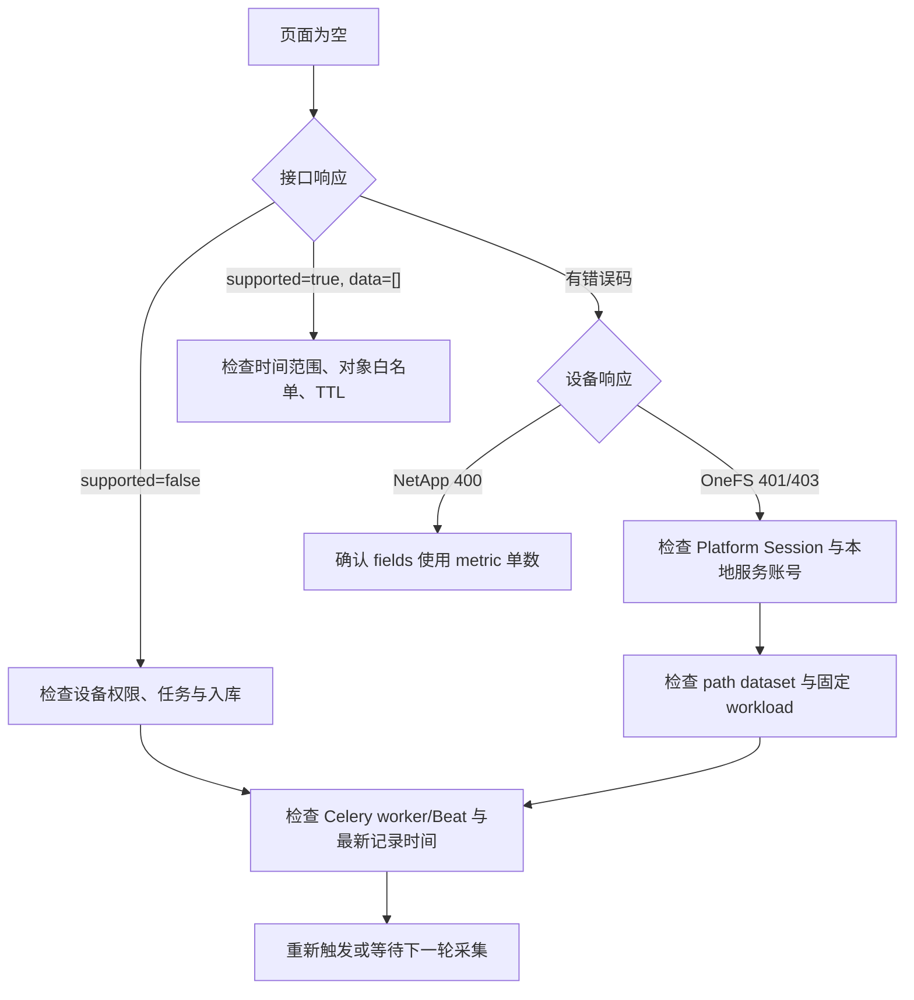

# 存储性能与事件采集排障手册

## 1. 适用场景

当存储集群详情的“性能分析”或“故障分析”显示空态、指标不正确、系统事件缺失，或采集任务报 `401/403/400` 时，按本手册定位。先区分“设备无数据”“设备有数据但解析失败”“任务未运行”“数据入库后筛选不到”四类情况。

## 2. 最短诊断路径



## 3. PowerScale / Isilon

### 3.1 账号与 Session

使用 System Zone 本地最小权限服务账号，不使用个人 NIS、LDAP 或 AD 账号。近期实机排障确认：NIS 人员账号在身份解析后可能导致下一次 Platform API 登录 `403`；替换为专用本地服务账号后，配额、事件与性能接口恢复可读。

先检查角色和用户：

```sh
isi auth users view diskpulse_monitor --zone System
isi auth roles view DiskPulseMonitor --zone System
```

必须具备 `ISI_PRIV_LOGIN_PAPI`、`ISI_PRIV_STATISTICS`、`ISI_PRIV_PERFORMANCE`、`ISI_PRIV_EVENT` 等只读权限；扩容还要求 `ISI_PRIV_QUOTA` 与 `ISI_PRIV_QUOTA_QUOTAMANAGEMENT` 写权限。完整权限清单和创建命令见[存储集群总览](../features/storage-cluster/overview.md#isilon-采集账号要求)。配置变更后重启 Celery worker。

### 3.2 path workload 不是目录存在性检查

`isi performance workloads list path` 只表示已观察或已固定的性能 workload，不能用它判断目录是否存在。目录存在性请单独检查：

```sh
ls -ld /ifs/data/example
isi performance datasets list
isi performance workloads list path
isi performance workloads pin path "path:/ifs/data/example"
isi statistics workload --dataset path
```

每个要在 DiskPulse 显示的 Directory Quota 都必须固定为 workload。固定后至少等待一个设备采样周期再观察；只增加 `ISI_PRIV_PERFORMANCE` 不会自动创建路径 workload。

### 3.3 常见现象与处理

| 现象 | 已确认根因 | 处理 |
| --- | --- | --- |
| 页面显示对象 `node` 或 `0ms` | 读取了节点磁盘延迟而非 path workload。 | 确认代码走 `performance/datasets`、`workloads`、`statistics/current`；页面请求传 `object_type=volume`。 |
| 接口有统计但解析为 0 条 | OneFS 延迟单位可能是 `seconds`，事件结构可能嵌套在 `events[]`。 | 保留设备时间，接受秒/毫秒/微秒；展开 event list，读取 event group 的 `last_event`/`causes`。 |
| 登录 `403`，后续性能/事件 `401` | 没有有效的 `platform` Session 或账号权限不足。 | 使用本地服务账号，确认 PAPI 登录权限；检查 HTTPS、端口、证书和 worker 重启。 |
| 有固定 workload 但页面没有路径 | 路径不在 PostgreSQL `Volume.name` 白名单，或不是 Directory Quota。 | 同步目录配额资源后再采集；不要删除白名单校验。 |

PowerScale 官方将 dataset、workload 与 current statistics 分别作为独立 API 资源；因此排障时必须分段确认，不能只验证一条 statistics key。[Dataset](https://www.dell.com/support/manuals/en-us/isilon-onefs/ifs_pub_onefs_api_reference/performance-datasets-resource?guid=guid-f036e2e1-edff-43a6-b422-c27b6fe9d938&lang=en-us) · [Workload](https://www.dell.com/support/manuals/en-us/isilon-onefs/ifs_pub_onefs_api_reference/performance-datasets-workloads-resource?guid=guid-50a8d00b-6800-485f-8b6d-1deb002f700e&lang=en-us) · [Current statistics](https://www.dell.com/support/manuals/en-us/isilon-onefs/ifs_pub_onefs_api_reference/statistics-current-resource?guid=guid-fb7c7796-3e27-45f1-8e0f-1f448555fb77&lang=en-us)

## 4. NetApp ONTAP

| 现象 | 已确认根因 | 处理 |
| --- | --- | --- |
| Volume 性能请求返回 `400/262197` | 请求字段名使用了不存在的复数 `metrics`。 | 使用 `fields=uuid,name,metric`；不要改回 `metrics`。 |
| 有 Volume 但无性能行 | `metric.latency` 缺失或采集任务未运行。 | 先检查设备响应中的 `metric`，再检查 worker 与 QuestDB 最新记录。 |
| IOPS/吞吐量为空 | 响应缺少 `iops.total` 或 `throughput.total`。 | 保持 `null`，不要把缺失字段替换为零。 |
| EMS 事件未显示 | EMS 时间范围、账号权限或事件字段不完整。 | 检查 `time/index/message/node/log_message`；不完整事件不会入库。 |

ONTAP 的性能接口使用 `metric` 属性承载 IOPS、延迟和吞吐量；这些指标的总值可用于 DiskPulse 的跨厂商标准字段。[ONTAP REST API reference](https://docs.netapp.com/us-en/ontap-restapi/pdfs/sidebar/Cluster.pdf)

## 5. DiskPulse 侧核验

1. 检查请求是否带正确时间范围和认证头：

   ```sh
   curl -G 'https://diskpulse.example/storage-pulse/api/storage-clusters/7/analytics/top-latency' \
     -H 'Authorization: Bearer <token>' \
     --data-urlencode 'start_time=2026-07-16T00:00:00+08:00' \
     --data-urlencode 'end_time=2026-07-16T23:59:59+08:00' \
     --data-urlencode 'object_type=volume'
   ```

2. 区分返回语义：`supported=false` 是从未成功采样；`supported=true` 且空数组是当前窗口无样本。
3. 检查 Celery worker 和 Beat 是否已加载新代码。Windows `solo` worker 执行 OneFS 长分页时，`celery inspect` 可能超时；同时查看进程、任务结果和目标库最新时间戳。
4. 确认 QuestDB 180 天 TTL 和分析接口最长 180 天窗口；超出窗口的数据不应期待从页面或导出中出现。
5. 如出现历史错误节点/父路径样本，不强行使用不兼容的 QuestDB 行级删除；当前查询的 PostgreSQL `Volume.name` 白名单会屏蔽它们，旧样本按 TTL 自然过期。

## 6. 验收清单

- [ ] NetApp 返回单数 `metric`，含至少一个 Volume 延迟样本。
- [ ] PowerScale 本地服务账号能建立 `platform` Session，并读取 dataset、workload、statistics 和事件。
- [ ] 所需 Directory Quota 已同步为 DiskPulse Volume，且都已固定为 `path` workload。
- [ ] Celery worker/Beat 已重启或确认加载当前版本。
- [ ] 性能接口对同一窗口返回预期路径/Volume，未混入 node 或父路径。
- [ ] 系统事件可按关键字、严重级别和分页查询，重复故障只聚合同一稳定 fingerprint。
- [ ] 页面切换指标时，ms、IOPS、B/s 独立展示；导出仍符合既有 `latency` section 契约。

未连接真实设备时，自动化测试只能覆盖字段解析、接口参数、单位换算和前端交互，不能替代上述真机验收。
