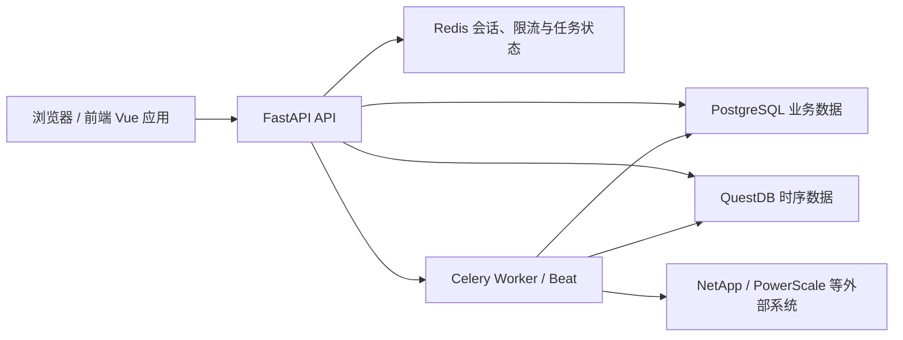

# 系统架构总览

本页描述当前运行时的跨层边界，不替代各层架构和功能专题中的事实说明。

| 层 | 当前职责 | 事实来源 |
| --- | --- | --- |
| 前端 | 页面、路由、用户状态、可访问性与 API 调用。 | [前端架构](./frontend.md) |
| 后端 | 认证后的 REST API、业务服务、权限、审计与任务编排。 | [后端架构](./backend.md) |
| 关系数据 | 业务实体、关系、配置、权限和审计状态。 | [数据库架构](./database.md) |
| 时序数据 | 容量、性能等监控趋势数据及其前向迁移。 | [数据库架构](./database.md) |
| 异步任务 | 存储采集、告警、备份和周期作业。 | [后端架构](./backend.md) |

所有跨层变更都必须读取对应实现层规范和功能专题；具体组合由[开发阅读矩阵](../../standards/documentation/development-reading-guide.md)定义。
