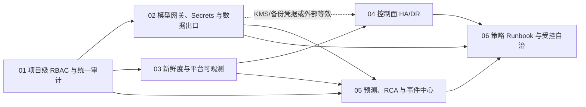

# 企业级 AI 存储智能运维实施计划索引

- 依据：[企业级 AI 存储智能运维调研报告](../../features/ai-storage-management/research.md)
- 状态：待实施；本索引和关联计划不代表当前功能已实现。
- 目标：将 DiskPulse 分解为六个可独立排期、测试、验收和交付的工作包，面向 NetApp 与 Dell PowerScale（Isilon）的芯片/IC 企业私有化运维场景。

## 执行顺序

| 顺序 | 工作包 | 计划文件 | 实施前置条件 | 目标时间 |
| --- | --- | --- | --- | --- |
| 01 | 项目级 RBAC 与统一审计 | [计划](./2026-07-17-220100-project-rbac-unified-audit-implementation-plan.md) | PostgreSQL 备份与变更窗口 | 0-3 个月 |
| 02 | 模型网关、Secrets/KMS 与数据出口 | [计划](./2026-07-17-220200-model-gateway-secrets-egress-implementation-plan.md) | 01、Vault、私有模型端点、网络出口策略 | 0-3 个月 |
| 03 | 遥测新鲜度与平台可观测 | [计划](./2026-07-17-220300-telemetry-freshness-observability-implementation-plan.md) | PostgreSQL 迁移、Prometheus、受保护指标 Token | 0-3 个月 |
| 04 | 控制面 HA/DR 与恢复基线 | [计划](./2026-07-17-220400-control-plane-ha-dr-implementation-plan.md) | 03、02 的 KMS/备份凭据或等效外部前置、高可用 LB、双节点基础设施、PostgreSQL HA、Redis Sentinel、备份对象存储 | 0-3 个月 |
| 05 | 预测、异常/RCA 与事件中心 | [计划](./2026-07-17-220500-forecast-rca-incident-center-implementation-plan.md) | 01、02（私有模型/模型网关）、03、至少 45 天合格历史数据、故障标注夹具 | 3-9 个月 |
| 06 | 策略、Runbook、审批与受控自治 | [计划](./2026-07-17-220600-policy-runbook-automation-implementation-plan.md) | 01-05、02 的 Secrets/KMS、隔离设备测试对象 | 9-18 个月 |

## 跨计划统一约束

- 新增控制面 API 一律位于 `/storage-pulse/api/v1`；现有未版本化 API 保持兼容，直到对应迁移计划完成且有弃用通知。
- 新增 PostgreSQL 表使用 Alembic 前向 revision；QuestDB 仍使用 `backend/questdb/migrations/` 的前向 SQL 迁移，不能混用两套机制。
- 所有生产变更遵循 RED → GREEN → 重构：先运行针对新增行为的失败测试，后实现，最后运行聚焦后端、前端、迁移和真实设备检查。
- 所有业务写操作都要经过资源作用域授权、统一 `AuditEvent`、敏感字段脱敏和稳定的 `trace_id`；高频遥测运行账本是受控例外，使用 `trace_id`、任务账本和聚合指标追溯，避免逐行审计噪声；AI 不能直接调用设备写 API。
- `super_admin` 是现有全局平台管理员的兼容名称；后续实现中可在对外说明中称为平台管理员，但不得改变既有超级管理员权限语义。
- 不把当前 AI 工具白名单方案视为自动化执行通道；设备写操作只有在第 06 工作包的审批、策略、验证和回滚机制完成后才能迁移。

## 总体完成门槛

- 跨项目越权为零，纳入范围的写操作审计覆盖率 `100%`。
- 活跃集群三类遥测可查询最后执行结果；健康、就绪和指标端点在依赖退化时具有确定语义。
- 控制面 PostgreSQL 通过隔离恢复演练达到 `RPO <= 5 分钟`、`RTO <= 30 分钟`；本期 QuestDB 仅 best-effort，不得被误表述为同等级保证或具有未经验证的 RPO/RTO。
- 容量预测和 RCA 必须通过历史回放门槛，才允许在页面标为高置信度；任何 AI 文字解释仅消费已验证证据。
- R1 自治动作达到成功率目标并完成隔离设备演练后才可启用；R2 始终需要不同用户审批，R3 始终不自动执行。
